# 幕间 · 可安装短剧 App

## 最新验收：云端交易与恢复应用通过

[打开云端App](http://106.54.37.247/#home)。RC2已部署上海Ubuntu：28项虚拟商城交易检查通过，覆盖中文注册登录、店铺、商品、幂等、取消返库、地址购物车及模拟支付/发货/收货。公网页面另完成中文账号注册、49元规格下单取消、重新登录、追剧收藏和视频实际播放至结束。

RC2备份恢复库在 `127.0.0.1:9082` 独立启动，12项资源/数据库/视频/商城/PWA检查通过；临时服务、凭据和数据库授权已清理，线上服务仍为 `UP/connected`。四个服务单元均已设置开机启用，备份timer有下一次计划。

整机重启已实测通过：应用/MySQL/Nginx/timer自动恢复，公网21项部署与6项版本检查重跑通过，商城页面可加载。仍待完成：备份定时器真实触发、可信HTTPS与手机真机安装。支付与物流始终为模拟；当前仍是演示候选版。[详细验收](docs/08-本轮验收记录.md) · [需求状态](docs/18-首版冻结范围与交付验收.md)。下面各轮记录按时间保留，以本节为当前状态。


## 2026-10-08：首版候选 App 已部署上海服务器

[打开云端App](http://106.54.37.247/#home) · [体验商城选款](http://106.54.37.247/#product/5)。RC2应用已上线：完整JAR与发布包逐字节一致，公网21项只读检查和6项版本文件SHA256核对通过。升级前与升级后均实际备份并完成隔离恢复，表内容及上传文件匹配；备份定时器已启用，尚未等待实际触发。公网实测两种规格切换、价格/库存和配图正常。

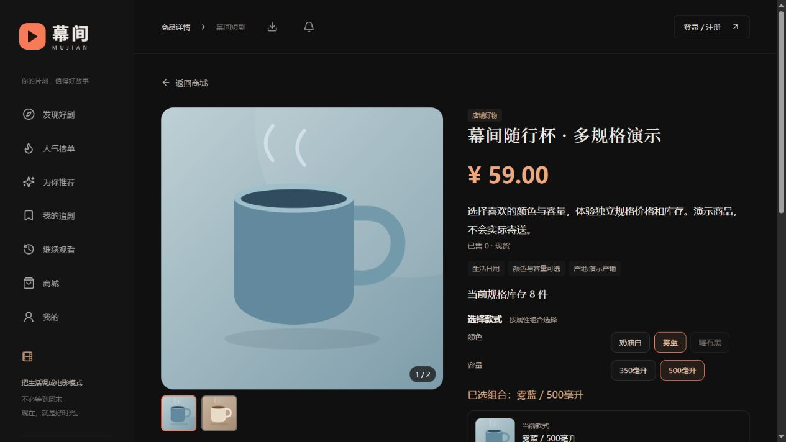

本轮未重跑登录后的交易全流程，也未完成恢复库应用启动、服务器整机重启、域名HTTPS或手机真机安装。支付和物流仍为模拟。RC2外层脚本的Nginx检查缺少Host导致尾部报错，应用实际更新成功，已另以正确Host复验；仓库和[RC3部署工具包](https://github.com/Tony-XUYANG/mujian/releases/tag/first-release-rc3-20261008)已修复这个检查，App代码未改变。[最新部署证据](docs/14-Ubuntu测试服务器部署.md)。以下章节为各轮历史记录。

## 首版候选版：本地验收与部署准备完成

已冻结为“可安装的短剧与商城演示PWA”。本轮在独立Ubuntu/MySQL验收库完成310项核心API检查，浏览器完成16项首版体验和22项评价检查；新增备份、表/图片校验、隔离恢复演练和每日备份定时器。恢复库上的应用启动及21项只读检查通过。

实际验收发现并修复断网后视频拖动读取失败：离线播放器直接读取本机缓存，断网刷新、播放、拖动及会话保留均通过。SW壳升级为v4，已缓存的视频继续保留。

**当前为候选版：云端尚未更新，无域名/可信HTTPS，手机真机安装待验。** 用户已确认先完成本地和部署准备。支付物流为模拟；原生APK、真实交易、内容审核和对象存储属于后续范围。

[首版范围、实现状态与验收证据](docs/18-首版冻结范围与交付验收.md) · [部署与恢复操作](docs/14-Ubuntu测试服务器部署.md) · [本地体验](http://127.0.0.1:8080/#home)

[下载首版候选版 Ubuntu 部署包](https://github.com/Tony-XUYANG/mujian/releases/tag/first-release-rc2-20261008)：包含最新 App、严格发布校验、自动备份升级脚本、HTTPS 配置模板、每日备份与隔离恢复工具。发布页列出源码版本、文件校验和及验收范围；云端升级前先备份。

## 2026-10-08：商家图片素材库已完成，本地可体验

打开「我的 → 我的店铺 → 图片素材」，可以统一浏览已上传商品图片，按中文名称搜索，查看商品/订单引用，重命名、收起和恢复。在主图、相册、自由规格和属性组合中点击「从素材库选择」即可复用，保存表单后才修改商品。

| 需求 | 实际效果 |
| --- | --- |
| 找到旧图片 | 12张分页、中文名称搜索、商品使用/订单留存/尚未引用筛选 |
| 减少重复上传 | 四类商品图片入口共用素材选择窗口，只回填草稿 |
| 清楚图片去向 | 显示商品数和订单数；同一商品多处使用只计一次 |
| 整理不丢旧单 | 收起可恢复、不删文件、不释放额度；下架商品/停售款/已取消订单仍计引用 |
| 手机操作 | 320/390px适配；取消选图保留父表单，中文错误可重试 |

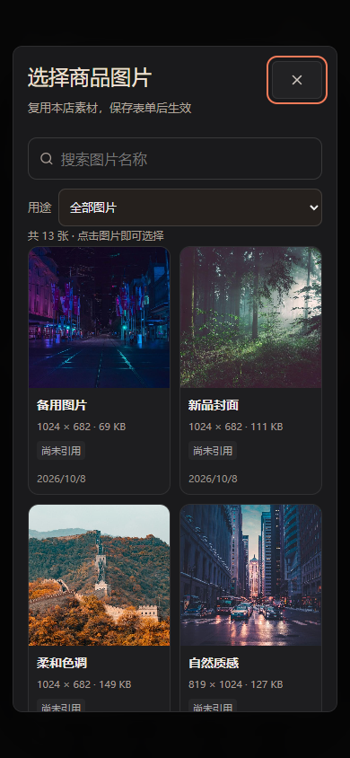

Linux构建通过；素材库API41项、浏览器18项、上传回归29项和配图回归28项，共**116项通过**。代码建表共38张。当前在[本地App](http://127.0.0.1:8080/#merchant)可用；**云端仍为上一轮上传裁剪版本，本次未完成云端更新**。[功能、接口、截图与限制](docs/17-商家图片素材库.md) · [部署状态](docs/14-Ubuntu测试服务器部署.md)。

[下载已校验的Ubuntu预发布包](https://github.com/Tony-XUYANG/mujian/releases/tag/media-library-20261008) · [云端升级操作](docs/14-Ubuntu测试服务器部署.md#已有上海测试服务器的接续操作)。源码和文档均公开，预发布包不含本机数据或账号。

## 2026-10-07：商家可以直接上传并裁剪商品图片

打开「我的 → 我的店铺」，在商品主图、相册或规格的「上传图片」中选择照片，裁剪后保存表单即可生效。支持手机拖动、缩放、预览和清空；不同款式仍各自配图，换图后历史订单保留原文件。

| 需求 | 当前实现 |
| --- | --- |
| 手机直接选照片 | JPG/PNG/WebP，5MB以内，方形裁剪和预览 |
| 主图、相册、每款规格 | 三处均可上传；相册最多6张，旧图片链接继续可用 |
| 保存可控 | 取消裁剪不修改草稿，上传后点击保存商品/规格才生效 |
| 图片归属与历史 | 本店上传图只能由本店绑定；独立文件不覆盖，历史订单原图可读 |
| 手机规格管理 | 320px属性组合改为分行卡片，无需横向拖动 |

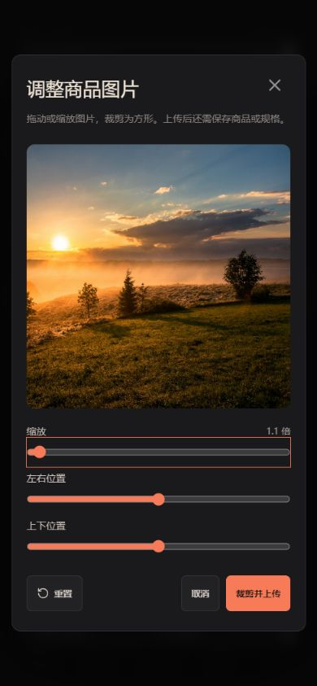

本地新增29项上传检查、28项规格配图及68项购物评价回归通过，共125项；Linux构建通过，部署后云端29项上传检查和21项部署检查通过。[操作、接口、截图与边界](docs/16-商品图片上传与裁剪.md)。图片内容审核、对象存储和自动清理仍待完善；支付、物流仍为模拟。

## 2026-10-07：规格配图已在 Ubuntu 测试服务器上线

[立即体验选款](http://106.54.37.247/#product/5)：选择「奶油白 / 350毫升」或「雾蓝 / 500毫升」，商品主图和选款区的小图会跟随颜色变化，价格、库存同步显示。

| 需求 | 已实现效果 |
| --- | --- |
| 每款展示自己的图片 | 商家在「我的 → 我的店铺 → 属性组合 / 规格库存」填写图片链接并预览；留空沿用商品主图 |
| 手机选款直观 | 主图随规格切换；选择按钮下方就能看到当前款式图片，无需回到顶部 |
| 购买时看清款式 | 购物车、确认订单使用对应规格图片；历史订单保存下单时的图片地址，后续编辑规格不会改写旧单 |
| 兼容旧数据 | 配图增量时36张表，上传增量后37张表；旧商品继续可用，旧客户端省略图片字段时保留原图 |


Linux 构建通过；本地 API 检查 **89 项通过**（配图28、旧规格43、属性矩阵18），部署后云端配图 **28 项**、只读部署 **21 项**通过。另已手动检查商家保存/重开、重复生成组合保留图片、320/390px布局。当时图片通过链接设置；本地上传裁剪已在最新版本交付，内容审核待完善；支付与物流仍为模拟，公网 HTTP 暂不能验证手机 PWA 安装。

[功能、接口与效果](docs/15-规格配图与订单图片快照.md) · [需求实现映射](docs/07-需求实现映射与演示效果.md) · [当前需求](docs/03-当前产品需求.md) · [当前架构](docs/04-当前技术架构.md) · [后续总需求](docs/05-增强后总需求.md) · [后续总架构](docs/06-增强后总技术架构.md)

## 2026-10-07：HTTP结算白屏修复已部署

公网 HTTP 页面点击“立即购买”曾因浏览器不提供 `crypto.randomUUID()` 而白屏。立即购买和购物车结算已改用 HTTP 兼容的安全随机请求标识，完成 Linux 构建并部署到上海 Ubuntu 服务器；应用及数据库健康检查通过，部署后公网只读检查 **21 项通过**。云端交易 API 此前另有 **28 项通过**，两组检查范围分别记录。

[本轮验证、截图及发布包信息](docs/08-本轮验收记录.md)。本次通过公网实际页面确认：中文账号登录、规格选择、立即购买49元和购物车结算59元均能创建订单，取消后库存恢复；测试购物车和虚拟地址已清空。支付、物流仍为模拟。

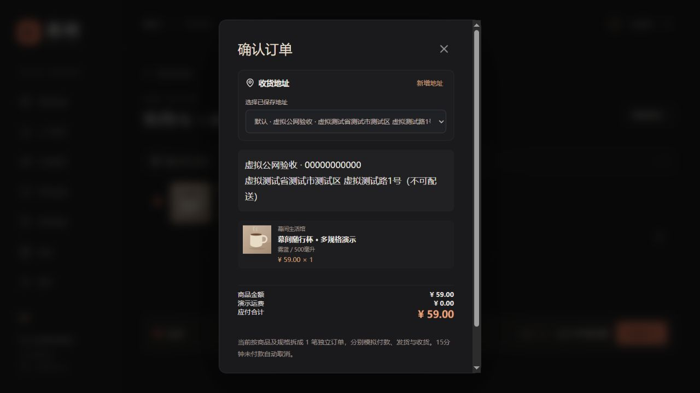

## 2026-10-07：上海 Ubuntu 测试服务器已部署

测试入口：[打开幕间](http://106.54.37.247/#home) · [打开商城](http://106.54.37.247/#mall)。已在腾讯云上海 Ubuntu 24.04 上运行 Nginx、Java 21 和独立 MySQL；服务开机启动、故障自动重启，应用和数据库仅监听本机。

| 本轮验证 | 实际结果 |
| --- | --- |
| 公网访问 | 首页、JS/CSS、8 部演示短剧和 5 件演示商品可用 |
| 播放与选购 | 视频 Range 返回 206；多规格商品从奶油白/350毫升切换至雾蓝/500毫升，价格由49元更新为59元，库存由12更新为8 |
| 只读部署检查 | Linux 执行 `verify-deployment.mjs`，21 项通过；未注册测试用户、创建订单或改库存 |
| 账号与隔离 | 服务器随机初始密码、JWT 和数据库密码；本机默认演示密码不用于云端，不复制本机用户数据 |
| 当前边界 | 无域名、无 HTTPS；IP HTTP 仅作测试，手机浏览器可访问，尚不能通过该地址验证 PWA 安装和离线能力 |

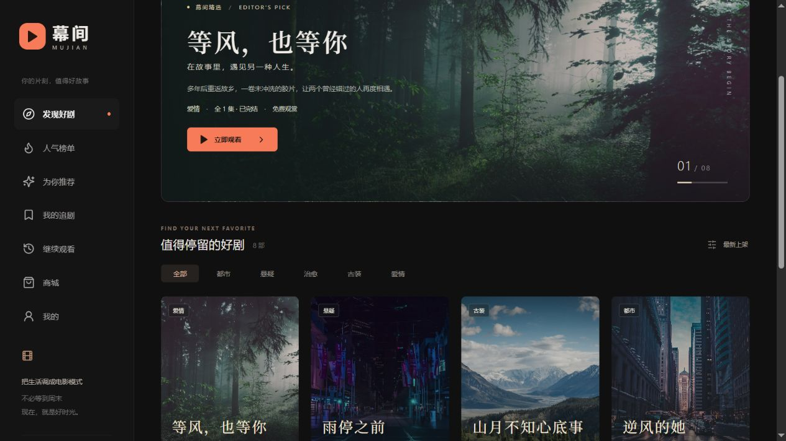

请使用虚拟测试信息，不使用真实收货信息或常用密码。支付和物流仍为模拟，不代表已具备正式运营条件。[部署、测试与运维说明](docs/14-Ubuntu测试服务器部署.md)。

## 2026-10-07：恢复运行、修复换款与 WSL 构建

App 已重新构建并恢复到 `http://127.0.0.1:8080`，健康接口返回数据库已连接，首页、JS/CSS 和商城可正常加载。

| 改进 | 现在的效果 |
| --- | --- |
| 换颜色、容量不卡住 | 只有“奶油白/350毫升”和“雾蓝/500毫升”有货时也能来回换款；自动清除冲突选择，选完整后才能加购 |
| 商家重复生成组合 | 不会把不同组合的价格、库存混到一起；添加属性组保留已有规格编号、价格、库存和停售状态 |
| 旧订单保护 | 首次启用属性矩阵时，有未付款旧订单会显示中文提示；失败整笔回滚，取消旧单后可以重新设置 |
| Linux 构建恢复 | WSL 下位于 Windows 盘的项目改在 Linux 临时目录构建，再复制产物回 E 盘，避开 npm/Maven 文件权限错误 |

本轮通过 **76 项检查**：属性矩阵 API 18、属性矩阵浏览器 15、旧规格 API 43；Linux Node 22 / Java 21 / Maven 构建通过。接口和浏览器验收运行在 Windows，服务继续使用原 Windows MySQL，尚未迁移数据库到 Linux。详见 [验收记录](docs/08-本轮验收记录.md) 与 [多规格规则](docs/13-多规格商品与库存.md)。

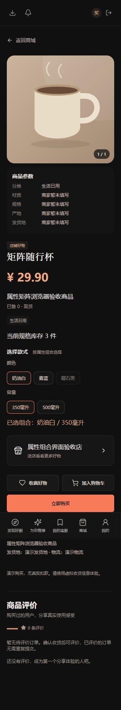

## 2026-10-05：商城属性矩阵与多规格选购已交付

现在可以从**视频同款/商城 → 商品详情选款 → 规格购物车 → 确认订单 → 查看规格快照**走完多规格购买流程。店主在「我的 → 我的店铺 → 属性组合」配置颜色、容量等属性，系统自动生成组合并分别维护价格、库存和在售状态；买家未选完整属性不能加购，售罄/停售款不可选。同一商品的不同规格可以分别改数量、移除和一起结算，取消或未付款到期只返还原规格库存。

| 已实现 | 直接效果 |
| --- | --- |
| 属性矩阵组合规格 | 每件商品最多3组属性、每组10个值、20种组合，例如“奶油白 / 350毫升”；每款独立价格、库存、在售状态 |
| 选款与防错 | 详情同步价格/库存，商品卡和视频小卡显示“起”，服务端校验规格归属和确认价格 |
| 规格购物车 | 同商品多款独立成行，支持选择、数量、删除、整批校验和失败回滚 |
| 订单与库存 | 订单保存购买时名称和价格；改名/停售不改历史，取消/超时准确返原规格 |
| 兼容旧商城 | 无规格旧商品、旧订单、旧默认购物车继续可用；属性矩阵阶段35张表，配图增量36张，上传增量后37张 |

 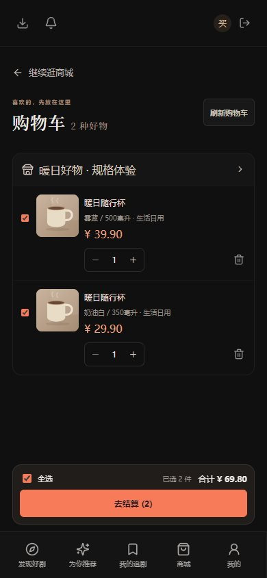

专项验收：旧规格API 43项，属性矩阵API 12项，属性矩阵浏览器7项；Windows Maven/Vite 构建通过，WSL 本轮因 HCS/0x800705aa 未启动。完整需求、接口、架构、截图和边界见[多规格商品与库存](docs/13-多规格商品与库存.md)。

## 2026-10-04：商品评价已接入购买流程

现在可以**确认收货 → 评价商品 → 选择1–5星并写体验 → 查看商品平均分**。详情页与已完成订单均有入口，复购可分别评价；下架后仍可从订单评价。仅本人已完成订单可提交，每单一次，游客可阅读。所有评分来自用户提交的演示订单评价，不伪造口碑；支付与发货仍为模拟。

| 已实现 | 实际效果 |
| --- | --- |
| 评价展示 | 平均分、总数、最近100条、昵称头像与时间；无评价显示暂无评分 |
| 收货后评价 | 主动选星、500字、复购选单、已评按钮同步；不新增个人页杂项入口 |
| 可靠性 | 中文失败重试、保留输入、并发不重复、公开数据不泄露订单号 |
| 手机使用 | 320/390px布局和订单弹窗、键盘评分已验收 |

| 手机商品评价 | 已完成订单中评价 |
| --- | --- |
| 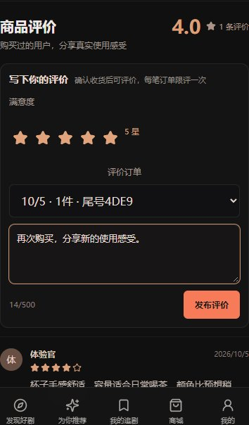 | 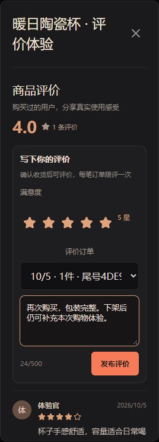 |

本轮206项通过：商城详版API68、评价浏览器22、购物浏览器32、原商城API44、基础API40。TypeScript/Vite/Maven构建通过；WSL启动仍报资源不足，本轮使用Windows环境完成验证。图片评价、商家回复、评价审核及真实售后仍待扩展。[需求、架构、接口及截图](docs/12-商品评价闭环.md) · [当前需求](docs/03-当前产品需求.md) · [当前架构](docs/04-当前技术架构.md) · [后续总需求](docs/05-增强后总需求.md) · [后续总架构](docs/06-增强后总技术架构.md)。

## 商城详版：参考抖音逛购，保留轻量观剧体验

这次把商城补成了能连续选购的流程：**分类找商品 → 看相册和参数 → 收藏/加入购物车 → 选择地址 → 多商品结算 → 查看订单动态**。

| 你能直接体验的变化 | 实现状态与入口 |
| --- | --- |
| 更完整的商城首页 | 场景推荐、六类分类、关键词、价格/销量排序、有货筛选、分页加载 |
| 更详细的商品页 | 相册切换、材质/规格/产地/发货地、长详情；店主可编辑 |
| 账号购物车 | 按店铺分组、数量、选择/全选、删除、失效提示、手机固定结算栏 |
| 常用收货地址 | 新增/编辑/删除、默认地址；结算内直接添加、立即购买自动填充 |
| 多商品一起提交 | 整批校验价格和库存，失败不扣库存；按商品拆成独立演示订单 |
| 好物收藏与订单详情 | 独立好物片单、订单编号/收货快照、实际发生的状态时间线 |

| 手机商城 | 手机购物车 | 确认订单 |
| --- | --- | --- |
| 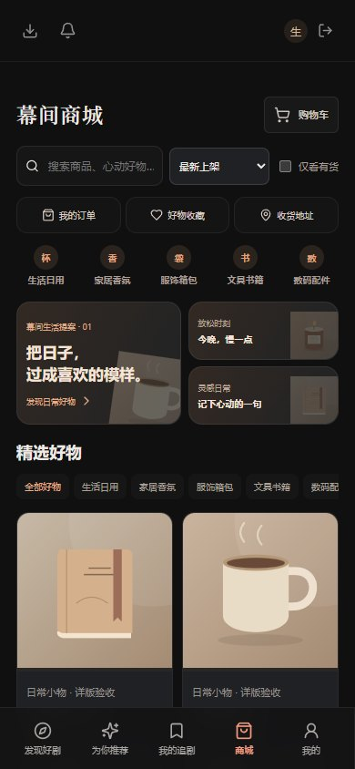 |  | 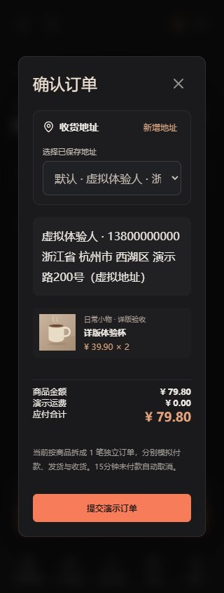 |

购物详版首轮新增46项接口检查与32项浏览器检查，连同当时回归共194项通过；属性矩阵增量及验证结果见上方记录。支付、发货仍为演示；真实运费、真实支付/物流/退款尚未接入。[完整需求、架构、接口与验收说明](docs/11-商城详版购物车与地址说明.md)。

## 2026-10-03 新增：商城、个人开店与视频带货

现在可以从**「商城」选购 →「我的」开店 → 发布带商品视频 → 视频下方小卡进店 → 下单 → 模拟支付 → 店主演示发货 → 买家确认收货**，完整走通一条购物链路。

| 你的需求 | 实现情况 | 去哪里看 |
| --- | --- | --- |
| 类似抖音的商城 | 商品搜索、价格排序、详情、店铺、立即购买、订单状态筛选已实现 | 导航「商城」 |
| 在「我的」注册店铺 | 一人一家店、中文店铺资料、商品新增编辑和上下架、库存、订单管理已实现 | 我的 → 我的店铺 / 开店 |
| 发视频时挂商品小卡 | 店主可发布视频链接并挂最多6件本店在售商品；播放页小卡、商品袋、进店购买已实现 | 我的 → 视频带货；演示剧「等风，也等你」 |
| 购买后能处理订单 | 下单预留库存、取消/15分钟超时返库、演示支付/发货/收货已实现 | 我的订单 / 店铺订单 |
| 手机上好用 | 底部五项主导航，390px/320px真实浏览器检查通过 | 可安装PWA、手机浏览器 |

**边界：支付与发货是明确标注的演示，不会真实扣款或寄送；视频以链接发布，暂不支持本地大视频上传。** 规格配图已交付；店铺审核、真实支付/物流和退款仍在后续规划；购物车和属性矩阵规格已交付。

| 商城效果 | 视频下方商品卡 | 我的与开店入口 |
| --- | --- | --- |
| 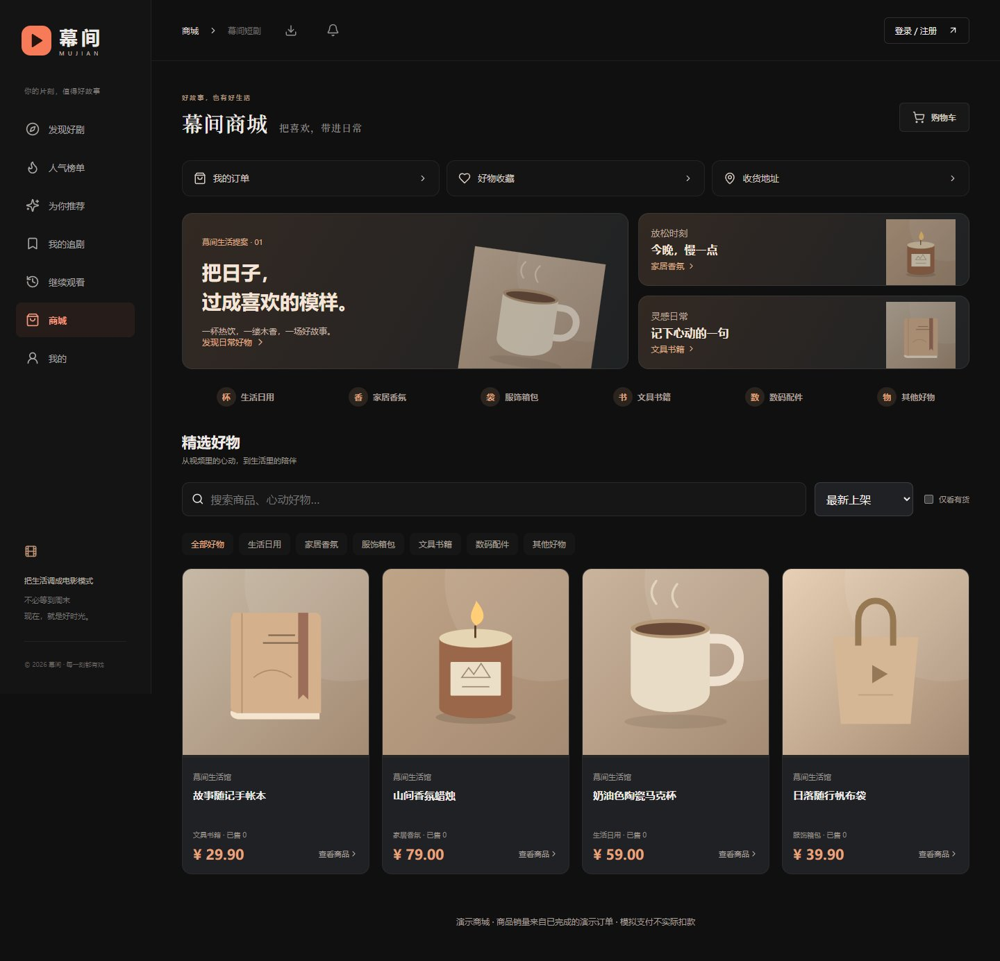 | 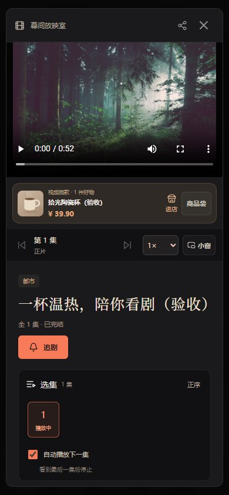 | 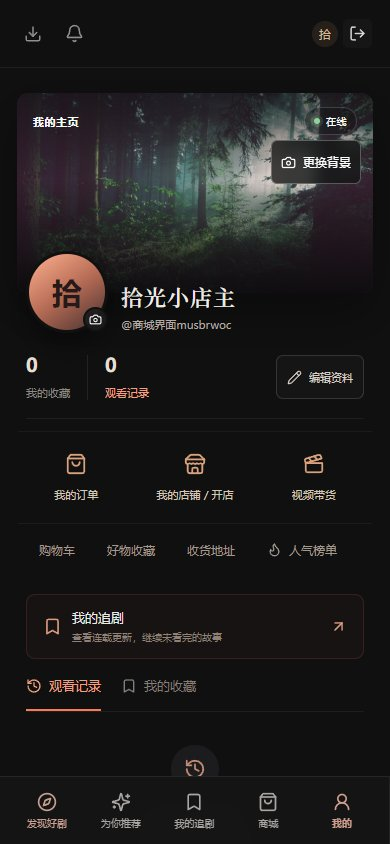 |

新增商城44项接口、8项数据库边界、24项浏览器检查；基础40项、分集28项回归通过，**总计144项**。Linux完成前后端构建。详细操作、接口、边界、截图和复验方法见[商城店铺与视频带货说明](docs/10-商城店铺与视频带货说明.md)；[需求实现映射](docs/07-需求实现映射与演示效果.md)标明全部功能对应关系。

## 2026-10-02 新增：为你推荐与心情选剧

**现在可以直接打开“为你推荐”，按行为偏好找到下一部短剧。** 推荐页是单列卡片流：登录后参考追剧、收藏和观看历史，游客按热度与新剧兜底；每张卡片显示中文推荐理由、连载状态、播放量和收藏量，并可直接进入播放器。“心情选剧”也已从随机选片升级为治愈、反转、爱情和换个活法四类分类入口。

推荐不是黑盒机器学习模型，而是后端可审计的规则排序，演示时可以直接说明权重和理由来源。接口为 `GET /api/recommendations`，前端入口为 `#recommend`。

## 2026-10-01 新增：预约、自动发布与更新提醒

**现在可以先预约下一集，到点上线后，从站内提醒直接开始播放。** 打开“我的追剧”，切到“更新日历”或“我的预约”；右上角铃铛是更新信箱。管理员在“内容管理 → 分集 → 发布排期”安排上线时间。

| 需求 | 当前实现 | 入口与效果 |
| --- | --- | --- |
| 提前知道什么时候更新 | 已实现：按北京时间展示排期、未来七天筛选、剧名/分集搜索 | 我的追剧 → 更新日历 |
| 预约未上线新集 | 已实现：预约/取消、个人预约、改期和取消状态同步 | 我的追剧 → 我的预约；已上线后可直接观看该集 |
| 内容按计划上线 | 已实现：创建、改期、取消、恢复、立即发布、到期自动发布 | 管理后台 → 分集 → 发布排期；未来新集不进入公开选集目录 |
| 追更提醒 | 已实现：预约和追剧用户收到站内新集提醒，重复关系去重 | 顶栏铃铛、未读数、全部/未读、分页、单条/全部已读；点击定位到新集 |
| 服务重启不丢排期 | 已验证：数据库保存计划，启动扫描补发逾期任务 | 实际停机跨过截止时间，重启后发布一次并生成一条提醒 |

| 更新日历 | 我的预约 | 更新提醒 |
| --- | --- | --- |
| 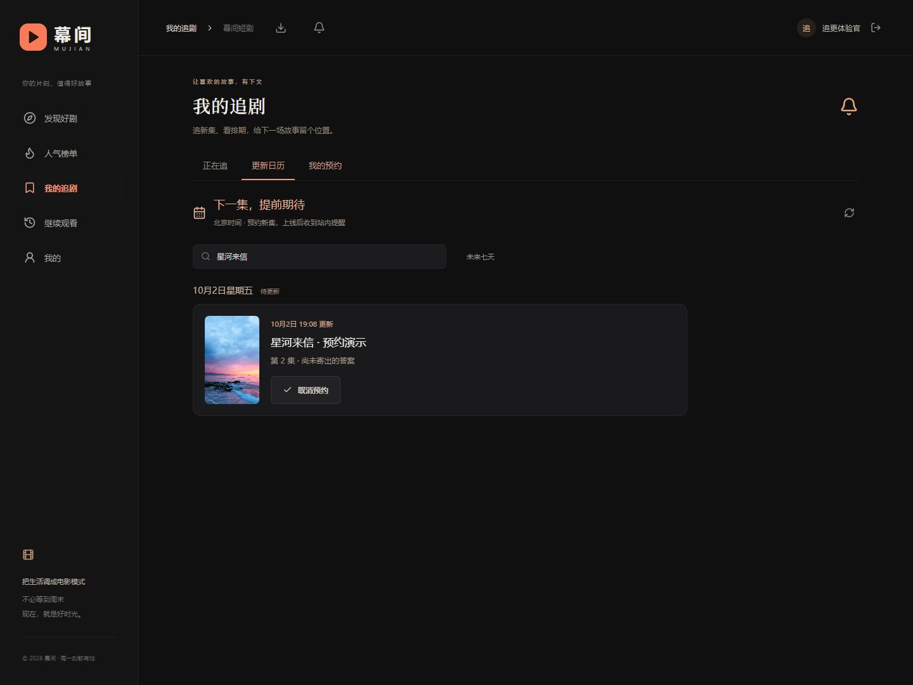 | 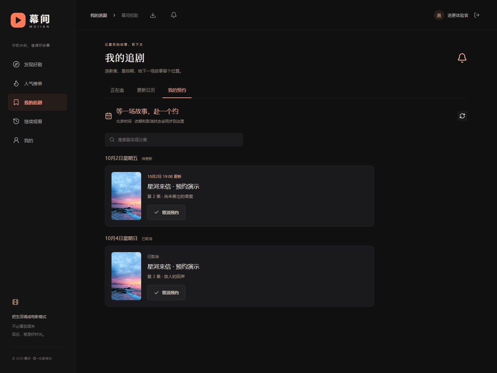 | 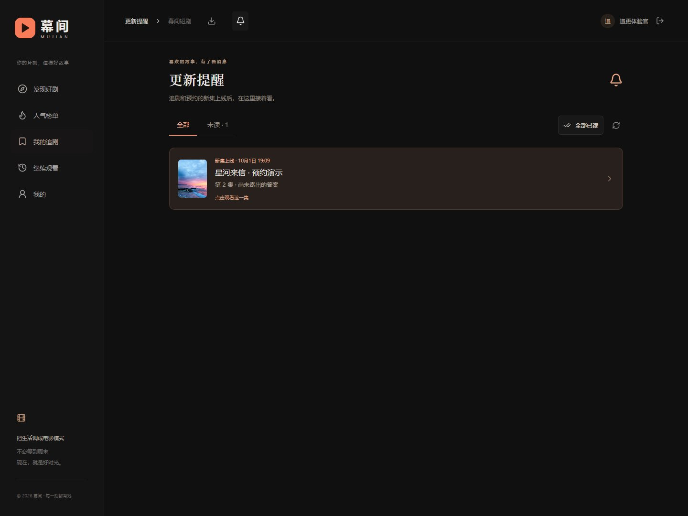 |

手机实拍：[日历](docs/screenshots/releases/mobile-calendar.jpg) · [390px 预约](docs/screenshots/releases/mobile-390-reservations.jpg) · [320px 预约](docs/screenshots/releases/mobile-320-reservations.jpg) · [更新信箱](docs/screenshots/releases/mobile-inbox.jpg) · [后台排期](docs/screenshots/releases/mobile-admin-schedule.jpg)。[桌面后台排期](docs/screenshots/releases/desktop-admin-schedule.jpg)。截图由真实浏览器生成，其中测试短剧在验收后清理。

本轮新增 **46 项接口检查、19 组浏览器检查**。验证脚本：

```bash
node scripts/verify-releases.mjs
node scripts/verify-releases-ui.mjs
```

首次升级会为演示剧“第七封来信”添加第 4、5 集的预约排期（首次初始化次日和后日北京时间 20:00），重启不重置。到期后会真实发布，因此集数与日历会随时间变化。演示章节仍共用 Sintel 视频。

交付边界：当前预约对象是**已上架短剧的未来分集**；尚无整部新剧首播预约、独立草稿库或系统推送。站内提醒在打开 App 后可见，关闭 App 不会弹出系统通知。详细规则见[预约发布与提醒说明](docs/09-预约发布与提醒说明.md)。


## 2026-10-01：分集播放与追剧版本

现在可以从“发现好剧”打开 **长街听风** 体验三集选集、自动连播、倍速和按集续播；**第七封来信** 初始为更新至 3 / 5 集的连载演示（后续排期到点后会增加已发布集数）。两部剧的演示章节共用 Sintel 示例视频，后台可替换为真实分集资源。

| 新功能 | 打开位置 | 已实现的效果 |
| --- | --- | --- |
| 任意选集与连播 | 播放器“选集” | 数字选集、正倒序、上一集/下一集、自动播放开关；末集停止 |
| 每集独立续播 | 播放器 / 继续观看 | 记住最近看的集及秒数；切集保存前一集，进度不会混用 |
| 一键追剧与更新片单 | 播放页“追剧” / 导航“我的追剧” | 全部、有新集、连载中、已完结筛选；显示新上线集数和未看完集数 |
| 倍速与小窗 | 视频下方工具栏 | 0.75×、1×、1.25×、1.5×、2×；倍速记忆；支持浏览器画中画，不支持时中文说明 |
| 分集缓存 | 播放页“离线缓存” | 按集保存，多集互不覆盖；共用媒体资源按引用保留 |
| 后台分集管理 | 内容管理 → 分集 | 集号、标题、片源的新增/编辑/删除，连载状态和总集数；重复集号、缺集完结校验 |

| 播放器与选集 | 我的追剧 | 后台分集 |
| --- | --- | --- |
| 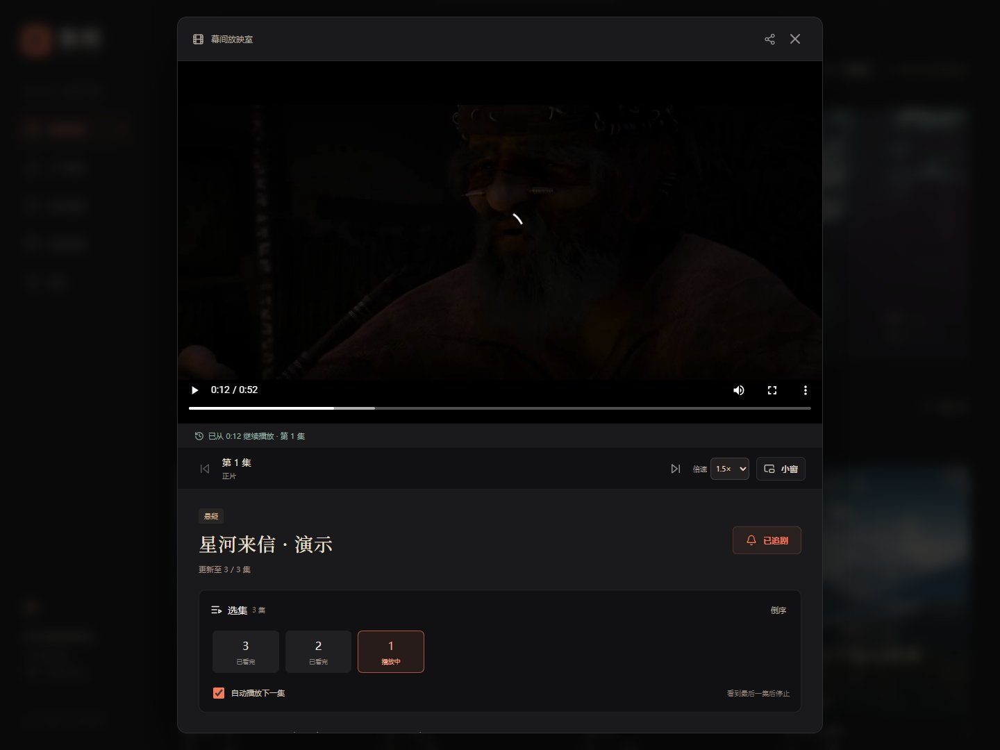 | 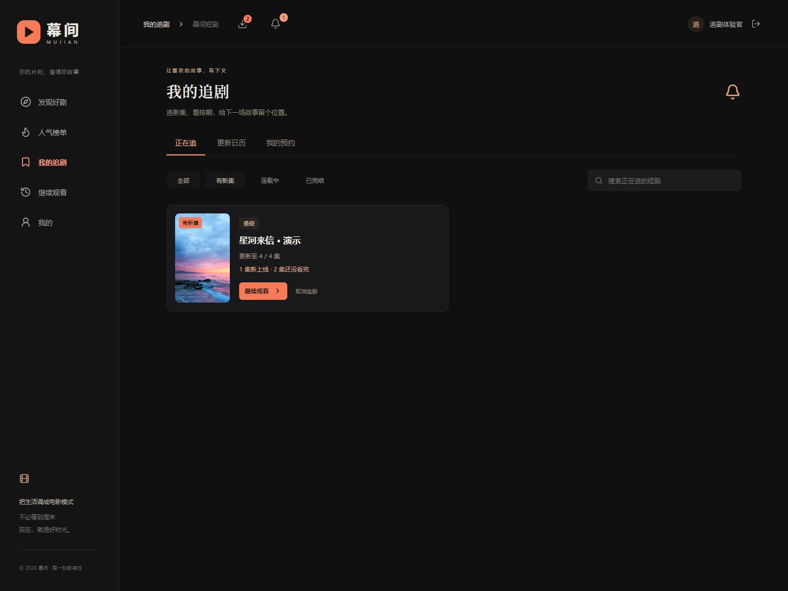 | 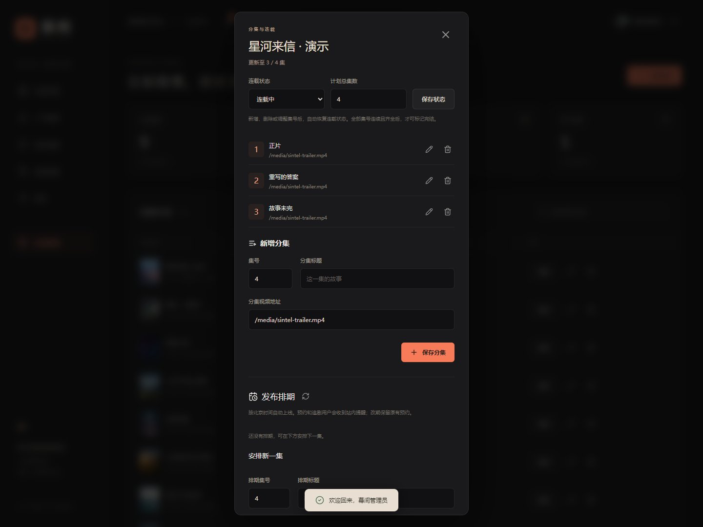 |

手机效果：[390px 播放器](docs/screenshots/episodes/mobile-390-player.jpg) · [320px 播放器](docs/screenshots/episodes/mobile-320-player.jpg) · [追剧](docs/screenshots/episodes/mobile-following.jpg) · [分集后台](docs/screenshots/episodes/mobile-admin.jpg)。截图中的“星河来信”是验收脚本创建并清理的测试短剧，日常体验请打开上面两部演示剧。

新增验证脚本：

```bash
node scripts/verify-episodes.mjs
node scripts/verify-episodes-ui.mjs
```

详见 [当前产品需求](docs/03-当前产品需求.md)、[当前技术架构](docs/04-当前技术架构.md)、[需求实现映射](docs/07-需求实现映射与演示效果.md) 和 [本轮验收记录](docs/08-本轮验收记录.md)。

幕间是一个参考红果短剧核心路径的可运行短剧 App 演示项目。用户可以发现短剧、搜索和分类筛选、播放、点赞收藏、发表评论、分享短剧链接，并从“继续观看”恢复上次位置；离线片库允许手动保存后断网播放。“我的”页采用抖音式封面背景、圆形头像和真实片单入口，头像与背景可以直接更换。管理员可以在内容管理后台维护短剧和查看基础统计。

项目把纸面上的 Spring Boot + React + MySQL 方案落成了完整的前后端应用，并用 PWA 交付可安装的 App 体验：手机浏览器可以将幕间添加到桌面，以独立窗口打开，移动端使用底部导航，已缓存内容可以在网络不稳定时继续使用。

> **当前交付形态**：可安装 PWA，不是已经签名的 Android APK 或 iOS IPA。真正原生包需要 Capacitor/原生壳、Android/iOS SDK、签名和发布配置。

## 一眼看懂：需求完成情况

| 来源/目标 | 关键要求 | 当前状态 | 可见效果或验证 |
| --- | --- | --- | --- |
| 纸面要求 | 用户注册、登录、BCrypt、Token | 已完成 | 登录/注册弹窗支持中文用户名；接口验证密码哈希、过期 Token 和无效 Token |
| 纸面要求 | 短剧列表、详情、视频播放 | 已完成 | 精选首屏、短剧网格、播放器、视频拖动播放 |
| 纸面要求 | 点赞、收藏、防重复 | 已完成 | 播放器互动按钮；联合唯一约束和并发验收 |
| 纸面要求 | 管理员短剧 CRUD | 已完成 | “内容管理”后台、实时统计、增删改查表单 |
| 红果核心 | 精选首页、分类、搜索 | 已完成基础版 | “发现好剧”、分类标签、标题搜索；“为你推荐”另提供单列推荐入口 |
| 红果核心 | 单列个性化推荐 | 已完成基础版 | “为你推荐”按追剧/收藏/观看历史规则排序，显示中文推荐理由；游客按热度和新剧兜底 |
| 红果核心 | 热播榜单 | 已完成 | “人气榜单”按播放量排序并显示名次 |
| 红果核心 | 播放进度、回访 | 已完成 | “继续观看”、详情自动续播、播放中定期同步 |
| 红果核心 | 评论互动 | 已完成 | 播放器“剧友说”评论列表和发表评论 |
| 红果核心 | 评论安全 | 已完成基础版 | 用户可按原因举报评论；管理员在“评论审核”中驳回、隐藏并恢复评论 |
| App 化 | 移动端、安装、离线 | 已完成 PWA 演示 | 移动端底部导航、App 壳预缓存、离线片库和断网视频拖动 |
| 个人主页 | 图片裁剪、编辑昵称、收藏和观看记录 | 已完成 | 头像/背景先预览裁剪再保存；中文昵称可编辑；片单支持搜索、管理、删除确认和继续播放 |
| 幕间创新 | 降低选择疲劳 | 已完成 | “心情选剧”按治愈、反转、爱情和换个活法四类筛选并直接打开播放器 |
| 红果差距 | 系统推送、会员、机器学习推荐 | 未完成 | 分集、小窗、倍速、分集预约、站内提醒和规则推荐已落地；系统推送、会员和更复杂的推荐仍在后续需求中 |

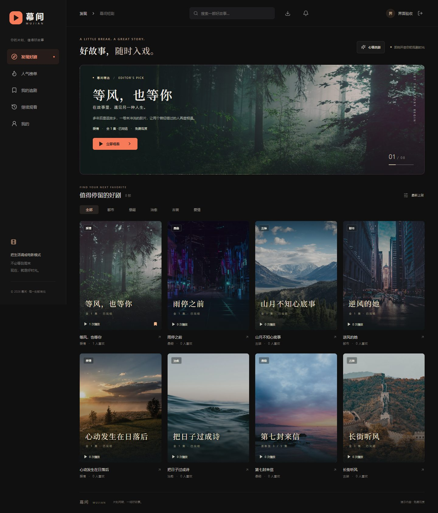

| 播放与续播 | 离线片库 | 管理后台 |
| --- | --- | --- |
| 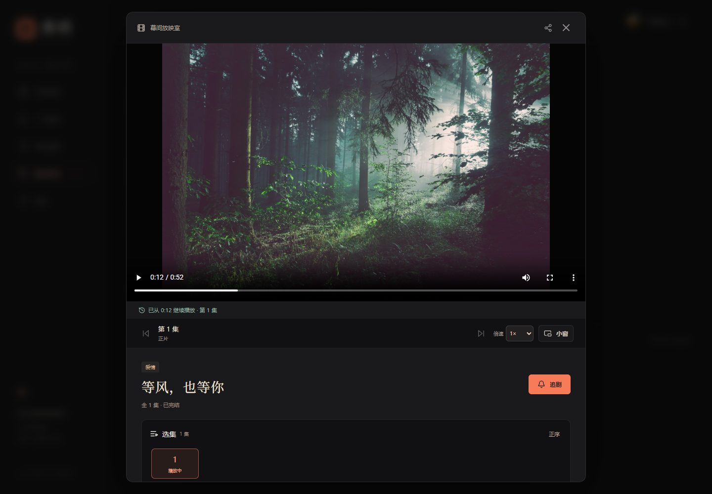 | 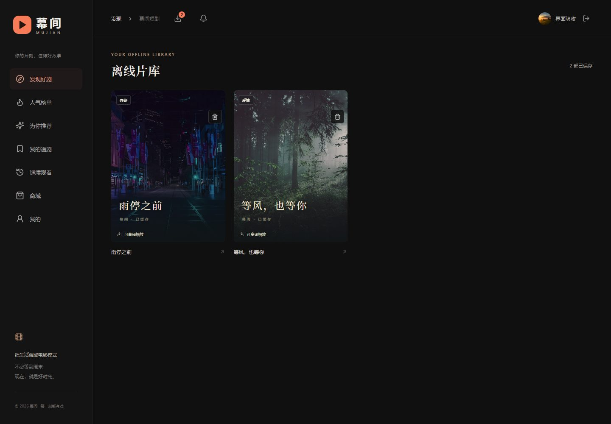 | 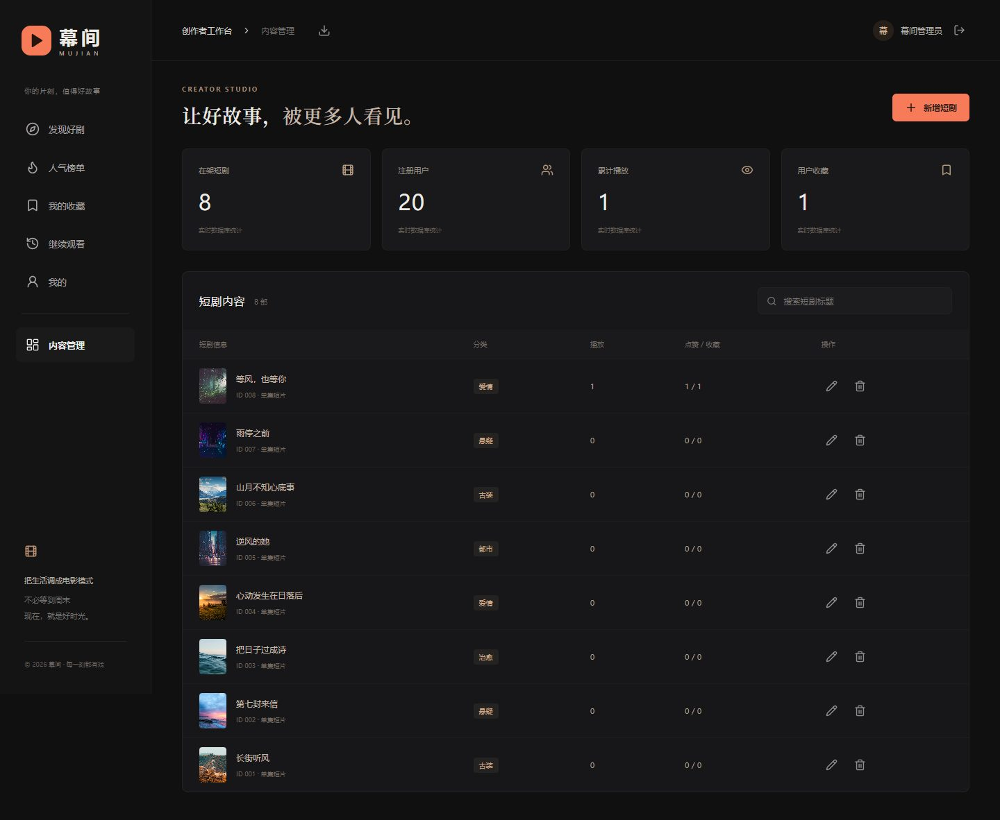 |

手机端：[390px 首页](docs/screenshots/mobile-390-home.jpg) · [320px 首页](docs/screenshots/mobile-320-home.jpg) · [390px 我的](docs/screenshots/mobile-390-profile.jpg) · [320px 我的](docs/screenshots/mobile-320-profile.jpg) · [离线播放](docs/screenshots/offline-player.jpg)。[桌面个人主页](docs/screenshots/desktop-profile.jpg)展示封面、头像和片单。截图由真实浏览器验收脚本生成，文档中对应的是可运行页面。

## 页面效果

### 发现首页

- 导航包含发现好剧、人气榜单、我的追剧、继续观看、我的和管理员内容管理。收藏位于“我的”片单中。
- 首屏使用精选内容大图、标题、简介、分类和“立即观看”按钮，下面是 8 条演示短剧卡片。
- 卡片显示封面、分类、播放次数、喜欢数和收藏状态；鼠标悬停显示播放入口。
- 搜索框和分类标签会直接刷新真实后端数据；排序可切换“最新上架/最多播放”。

### 为你推荐

- 单列卡片流展示封面、推荐理由、分类、连载状态、播放量和收藏量，点击卡片或“立即观看”直接进入播放器。
- 登录后追剧、收藏和观看历史分别按 4/3/1 的分类偏好权重参与排序；游客使用热度与新剧兜底。
- “换一批”会重新请求推荐接口；推荐理由明确告诉用户为什么看到这部短剧。

### 播放器

- 弹层播放器支持视频播放、拖动、播放计数、点赞/取消点赞和收藏/取消收藏。
- 登录用户的进度在播放中约每 15 秒及暂停、结束、关闭时同步；重新打开自动定位到上次位置。
- 分享生成 `/#watch/{id}` 直达链接；下方有离线缓存、版权演示片源说明和“剧友说”评论区。
- 游客可以查看评论；登录后可以发布最多 500 字评论。
- 每条评论提供举报入口；举报原因固定为不友善/攻击、广告/无关、剧透/违规或其他问题，同一用户重复举报幂等更新。

### 继续观看和我的

- “继续观看”按最近观看时间展示历史，卡片显示进度百分比，点击后从保存位置播放，可单条移除。
- 顶栏下载入口打开离线片库；断网重启后，已缓存视频仍可播放和拖动，可按条目移除。
- “我的”展示账号、在线/离线状态、抖音式封面背景和圆形头像；支持更换头像/背景，收藏和观看记录用两个 Tab 展示，短剧卡片可直接打开播放器。
- 更换图片时可拖动、缩放及调整位置，确认后保存；取消不会上传。昵称支持中文编辑，收藏和历史可搜索、逐条管理，失败后可重试。
- 手机端导航固定在底部，内容区为单列/双列自适应布局，播放器按钮会自动换行。

### 管理后台

- 管理员登录后出现“内容管理”入口。
- 顶部显示在架短剧、注册用户、累计播放和用户收藏四项实时数据库统计。
- 表格支持标题搜索、查看、编辑和删除；新增/编辑表单校验分类与资源地址。
- 评论审核区支持待处理、全部、已处理和已驳回筛选；管理员可驳回举报、隐藏评论，或恢复已隐藏评论。
- 删除短剧后，前台列表和对应点赞、收藏、历史、评论关系同步清理。

## 功能清单

### 用户端

- 注册、登录、退出登录、8 小时 JWT 会话；用户名支持中文、字母、数字和下划线，注册校验与失败提示使用中文。
- 首页精选、分类筛选、标题搜索、最新/热门排序。
- 人气榜单、短剧详情、视频播放和 Range 拖动。
- 点赞/取消点赞、收藏/取消收藏、我的收藏。
- 观看历史、观看进度同步、继续观看、删除历史。
- 查看评论、发表评论、分享、离线缓存。
- 为你推荐、心情选剧、安装幕间 App、在线/离线状态提示。
- 个人主页头像/背景图片上传，服务端限制图片类型、尺寸和 5MB 大小。
- 图片裁剪预览、资料昵称编辑、片单搜索和带确认的移除操作；网络和上传错误显示中文原因。

### 管理端

- 管理员角色隔离和普通用户 403 拒绝。
- 短剧数量、用户数量、播放量、收藏量统计。
- 短剧新增、编辑、删除、查询。
- `http/https` 或安全 `/media/` 资源地址校验。

### 安全和数据规则

- 密码使用 BCrypt，不保存明文。
- JWT 使用配置化密钥和 8 小时过期时间。
- 用户名唯一；点赞、收藏、观看历史使用联合唯一约束。
- 外键级联清理，避免删除短剧后残留互动数据。
- 所有 SQL 使用 JdbcTemplate 参数绑定。
- 接口统一返回可读 JSON 错误，覆盖 400/401/403/404/409。

## 技术栈与目录

| 层 | 技术 | 目录 |
| --- | --- | --- |
| 前端 | React 19、TypeScript、Vite、Lucide | `frontend/src` |
| App 体验 | Web App Manifest、Service Worker、Cache Storage | `frontend/public`、`frontend/index.html` |
| 后端 | Java 21、Spring Boot 3.5.6、Spring Security | `backend/src/main/java` |
| 数据库 | MySQL 8.4、JdbcTemplate、参数化 SQL | `backend/src/main/resources/schema.sql` |
| 验收 | Linux/Windows 构建脚本、HTTP、Service Worker 与浏览器验收 | `scripts` |
| 文档 | 产品需求、竞品分析、技术架构和实现映射 | `docs` |

核心后端文件：

- `AuthController.java`：注册、登录和当前用户。
- `DramaController.java`：短剧列表、详情、播放量、点赞、收藏和推荐接口。
- `EngagementController.java`：观看历史、进度和评论。
- `AdminController.java`：后台统计和短剧 CRUD。
- `ProfileMediaController.java`：登录用户头像和主页背景图片上传、缩放与静态资源回显。
- `DramaRepository.java`：短剧查询、互动统计和规则推荐分数 SQL。
- `SecurityConfig.java`：JWT、BCrypt、角色权限和错误响应。

核心数据表：

| 表 | 用途 |
| --- | --- |
| `user` | 用户、密码哈希、昵称、角色 |
| `user_profile` | 用户头像和主页背景地址，与用户一对一关联 |
| `drama` | 标题、封面、简介、视频地址、分类和播放量 |
| `user_favorite` | 用户收藏关系，联合唯一 |
| `user_like` | 用户点赞关系，联合唯一 |
| `watch_history` | 用户观看进度和最近观看时间，联合唯一 |
| `drama_comment` | 短剧评论和评论用户 |
| `drama_comment_report` | 用户对评论的举报记录；同一用户/评论唯一，状态为待处理、已处理或已驳回 |
| `drama_comment_moderation` | 评论当前可见状态和管理员处理记录，支持隐藏与恢复 |

## 运行项目

项目路径：`E:\mujian`

### Linux / WSL

需要 Node.js 20+、Java 21、Maven 3.9+ 和已启动的 MySQL 8；默认数据库地址是 `127.0.0.1:3307/mujian`。先创建数据库和有建表权限的用户（可通过 `DB_URL`、`DB_USER`、`DB_PASSWORD` 覆盖默认值），然后运行：

```bash
cd /mnt/e/mujian
bash scripts/build.sh
bash scripts/start.sh
```

启动后访问 [http://127.0.0.1:8080](http://127.0.0.1:8080)，验收可运行 `node scripts/verify.mjs` 和 `node scripts/verify-sw.mjs`。WSL 与 Windows 默认可能不共享 `127.0.0.1` 网络；若 MySQL 在 Windows 侧，需按实际网络设置 `DB_URL`。Linux 脚本不自动安装或启动 MySQL。

WSL 中 `/mnt/e/mujian` 等 Windows 挂载目录会自动使用 `/tmp/mujian-build.*` 编译前后端，完成或失败后清理临时构建目录；最终前端产物和 JAR 保存在原项目目录。可用 `MAVEN_REPO_LOCAL` 指定已有依赖缓存。本机本轮命令为 `MAVEN_REPO_LOCAL=/mnt/c/Users/Administrator/.m2/repository bash scripts/build.sh`，构建工具本身均运行在 Linux。

### Windows 本地演示

双击 `start.cmd`，或在 PowerShell 执行：

```powershell
cd E:\mujian
.\scripts\start.ps1
```

然后打开 [http://127.0.0.1:8080](http://127.0.0.1:8080)。首次构建或修改前端后执行：

```powershell
.\scripts\build.ps1
.\scripts\start.ps1
```

### 本机演示账号

| 身份 | 用户名 | 密码 | 可演示内容 |
| --- | --- | --- | --- |
| 普通用户 | `demo` | `Demo123!` | 点赞、收藏、评论、继续观看 |
| 管理员 | `admin` | `Admin123!` | 普通用户能力 + 内容管理 |

以上账号密码仅用于本机演示。云端测试服务器的 `admin`/`demo` 使用独立随机密码，保存在服务器 root 专用文件中，不在仓库或聊天中公布。正式运营前应关闭示例初始化、配置 HTTPS，并按实际服务办理备案。

## 推荐演示流程

1. 打开首页，展示精选首屏、短剧网格、分类和“心情选剧”。
2. 打开“为你推荐”，展示单列卡片、中文推荐理由，点击“换一批”并直接播放一部短剧。
3. 搜索“雨停”或切换“悬疑”，打开播放器并播放几秒。
4. 以 `demo` 登录，点击点赞、收藏，发布一句评论，暂停视频，再回到推荐页观察悬疑偏好理由。
5. 打开“继续观看”，展示进度百分比；打开“我的”，预览裁剪头像与背景、编辑昵称、搜索和管理片单，在收藏和观看记录之间切换并继续播放。
6. 回到发现页，展示榜单和收藏列表；在播放器点“离线缓存”，再打开离线片库。
7. 退出后以 `admin` 登录，打开“内容管理”，展示实时统计和 CRUD 表单。
8. 新增或编辑短剧，回到发现页确认内容同步；删除测试记录后确认前台消失。
9. 介绍数据库联合唯一约束、权限校验、PWA 方案和 Codex 的分块开发流程。

## 验收证据

执行：

```bash
cd /mnt/e/mujian
bash scripts/build.sh
bash scripts/start.sh
node scripts/verify.mjs
node scripts/verify-sw.mjs
# 有 Chromium/Edge 与 Playwright 时：node scripts/verify-ui.mjs
# 个人主页专项：node scripts/verify-profile.mjs
```

当前自动 HTTP 验收结果：**40 checks passed**；新增个人主页专项 **11 组检查通过**。本轮覆盖评论举报、管理员审核、隐藏和恢复。Service Worker 缓存/Range 检查和真实浏览器流程均通过，详细记录见 [本轮验收记录](docs/08-本轮验收记录.md)，实际页面截图见 `docs/screenshots/`。图片调整过程见[手机裁剪预览](docs/screenshots/mobile-profile-crop.jpg)。

覆盖范围包括：

- 数据库真实连接、公开内容列表和前端首页。
- 错误密码、弱密码、重复注册、无效/过期 Token。
- 管理员登录、普通用户 403、管理员新增/编辑/删除。
- 不安全资源地址拒绝、点赞/收藏重复和并发幂等。
- 重新登录后的数据持久化、收藏列表和级联清理。
- 视频 Range 拖动播放。
- 匿名查看评论、登录发表评论、详情续播数据和观看历史删除。
- 评论举报、管理员查看待处理举报、隐藏评论和恢复评论。
- PWA manifest、App 壳资源清单、Service Worker、离线媒体 Range 和浏览器端断网流程。

构建验证：

- `npm run build`：通过。
- Linux `mvn -B -ntp package`：通过；当前无 Java 单元测试，接口行为由 HTTP 验收覆盖。
- 本轮提交文件的 `git diff --check`：通过。

## 文档导航

| 文件 | 内容 |
| --- | --- |
| `docs/01-纸面需求.md` | 用户提供的原始需求和 Codex 协作要求 |
| `docs/02-红果竞品分析.md` | 红果公开能力拆解、幕间映射和差异化 |
| `docs/03-当前产品需求.md` | 当前版本角色、页面、规则和验收 |
| `docs/04-当前技术架构.md` | 当前后端、前端、数据库和 PWA 架构 |
| `docs/05-增强后总需求.md` | 竞品核心能力 + 幕间创新后的总 PRD |
| `docs/06-增强后总技术架构.md` | 总体架构、演进、原生 App 路线和运维 |
| `docs/07-需求实现映射与演示效果.md` | 一眼查看需求、代码位置、页面效果和验收证据 |
| `docs/08-本轮验收记录.md` | 本轮改进、验证结果、截图和运行环境 |
| `docs/14-Ubuntu测试服务器部署.md` | 上海服务器实测、部署包、端口、凭据管理、更新与回退 |

## 当前边界

当前 8 条短剧标题和简介是演示文案，共用 Sintel Trailer 片源。播放器会显示 Sintel/Blender Foundation/CC BY 3.0 署名；不能把当前内容描述成完整商业短剧版权库。

当前未交付整剧首播预约、机器学习级复杂推荐算法、视频上传/转码、广告、会员付费、弹幕、系统推送、完整审核工作台、Android APK 和 iOS IPA。评论举报、基础隐藏/驳回/恢复已交付；批量审核、自动审核和更完整的审核运营能力仍待建设。更新日历、分集预约、自动发布、站内更新提醒、规则推荐和分类心情选剧已交付。分集、自动连播、追剧片单、倍速和浏览器支持时的画中画已交付。

## 素材与版权

封面来源和编号见 `ASSETS.md`。示例视频为 Sintel Trailer，© Blender Foundation，CC BY 3.0，来源：[sintel.org](https://www.sintel.org) 和 [W3C media](https://media.w3.org/2010/05/sintel/trailer.mp4)。

## GitHub

仓库已经设置为公开：

[Tony-XUYANG/mujian](https://github.com/Tony-XUYANG/mujian)
