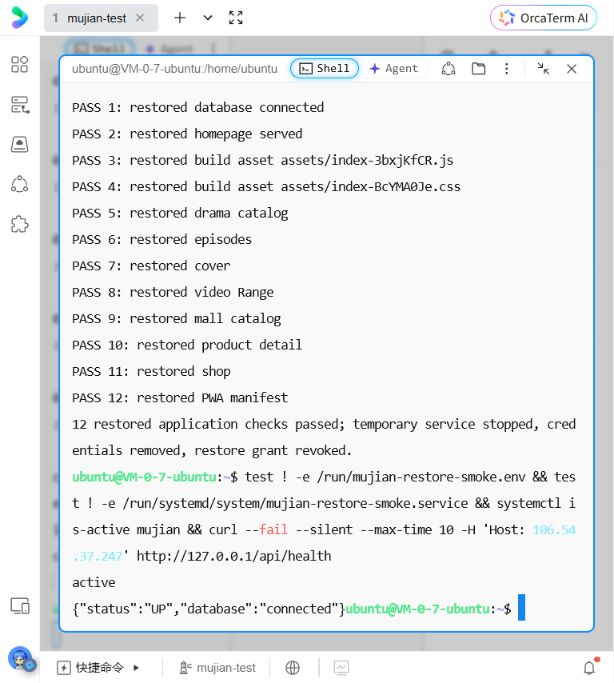

# 幕间本轮改进与验收记录

## 最新：云端交易和恢复应用（2026-10-08）

18:32:14 CST发出 `sudo systemctl reboot`，终端断开；18:32:23为新启动时间。重连后mujian/mysql/nginx/mujian-backup.timer均active及enabled，健康UP/connected。启动过渡曾返回502，随后公网21项部署检查和6项版本SHA256重跑全部通过，公网页面商城重新加载商品成功。[重启证据](screenshots/rc2-deployment/reboot-result.jpg) · [重启后商城](screenshots/rc2-deployment/reboot-mall.jpg)。整机重启现已通过；下文同日较早待验状态保留为历史记录。

WSL Ubuntu对RC2公网测试环境执行 `APP_URL=http://106.54.37.247 node scripts/verify-cloud-commerce.mjs --test-environment`，28项通过：中文注册/校验/登录、权限、店铺、测试商品、请求幂等、取消返库、地址、购物车、模拟支付/发货/收货和订单时间线。卖家15、买家17、商品10是虚拟验收记录；未付款单取消、地址/购物车清理、商品下架，审计账号与订单保留。

公网真实页面另使用随机中文账号完成注册、49元奶油白规格下单并取消，确认库存恢复；退出重新登录后状态正常。播放器追剧/收藏回显，示例视频实际解码至52.208秒结束。该页面检查未证明云端部分进度重开续播、离线或真机安装。

在RC2恢复目标 `/var/lib/mujian-restore/drill-IPxgHYYL`，新增 `deploy/verify-restored-app.py` 启动临时服务，仅监听 `127.0.0.1:9082`，连接恢复库 `mujian_restore_20261008094938_0294fda8`。数据库、首页、JS/CSS、短剧、分集、封面、视频Range、商城、商品、店铺及PWA共12项通过；测试结束临时服务停止、环境文件删除、恢复库临时授权撤销，线上服务再次确认active及UP/connected。

四个服务单元 `mujian/mysql/nginx/mujian-backup.timer` 均enabled，timer有下一次计划但尚未观察真实执行。整机重启、域名HTTPS及手机真机安装仍待完成。恢复启动可运行迁移/调度，仅作用于隔离库；表/文件精确比对发生于启动前。脚本不在既有RC3包中，应从本次仓库提交获取。



以下保留此前各轮记录，“未启动恢复应用”和“交易待验”为历史状态，以本节为准。

## RC2云端部署与数据恢复（2026-10-08）

RC2已上传并部署上海Ubuntu。包外SHA256、完整JAR cmp、21项公网可用性及6项前端版本SHA256全部通过，资源为index-3bxjKfCR.js / index-BcYMA0Je.css。升级前和升级后分别备份，均恢复到新的数据库与目录，表行数/校验和及图片逐字节匹配，线上数据未替换。应用/MySQL/Nginx/备份timer为active。公网浏览器两种规格49元/59元、库存12/8、冲突选择清除和配图正常。

RC2外层脚本尾部因Nginx请求缺少Host解析默认站点HTML时报错；应用实际升级成功，以正确Host和公网检查复验确认。修复脚本要求PUBLIC_HOST，4项隔离测试通过。云端恢复只验证数据库/文件，本轮未启动恢复应用、整机重启、等待timer触发或重跑登录交易链路；HTTPS与真机仍待验。完整路径、源码、校验和和截图见[部署证据](14-Ubuntu测试服务器部署.md)。以下记录保留各轮历史状态。

## 升级后的版本识别（2026-10-08）

新增只读 `verify-deployed-version.mjs`：根据选定构建目录的资源清单，比对首页、清单、SW、安装清单和JS/CSS的SHA256，避免旧版通过健康检查而被误认为升级成功。独立Linux候选服务9080六个文件全部一致；公网服务器仍为旧版JS/CSS，被脚本按预期拒绝。旧版公网的21项可用性检查通过，不能替代版本验收。

新增 `deploy/check-server-ubuntu.sh`，可检查实际JAR与候选JAR是否逐字节一致、服务运行/开机启动、Nginx语法、应用数据库健康和备份定时器。本轮只完成该shell脚本语法检查，没有连接云端执行，没有读取账号或环境密钥。该工具在RC2发布之后加入仓库，RC2包仍保持原始内容与校验和。云端升级仍等待已认证终端执行接续命令。

## 候选包接续部署工具（2026-10-08）

新增严格发布清单和源码提交校验、先备份再升级的接续脚本、HTTPS配置模板与手机验收文档。包内 `SOURCE_COMMIT` 现在也参与SHA256校验。升级健康检查必须同时满足 `UP/connected`，数据库失联时自动回退原JAR。

Ubuntu中执行发布校验8项通过（选中版本不符、JAR篡改、缺项、重复、清单穿越、非法提交和软链接拒绝）；真实升级脚本在隔离目录配合模拟systemctl/curl执行4种路径通过（正常升级、重启失败、数据库失联、相同版本无需重启）。测试保留原JAR、校验链接回退和定时器启用顺序，不操作现有服务和数据库。HTTPS模板用本地临时自签证书通过Nginx配置检查；这只证明模板语法和证书加载，未申请可信证书，也未配置公网HTTPS。备份校验8项回归通过。

本轮旧版公网只读检查21项通过，入口仍为 `index-Dch4hN0P.js`；云端没有更新。新增检查不合并为云端业务验收或首版真机验收。接续步骤见[Ubuntu部署](14-Ubuntu测试服务器部署.md)和[HTTPS与真机验收](19-HTTPS与手机安装验收.md)。

## 首版候选版收尾（2026-10-08）

独立WSL Ubuntu26.04/MySQL8.4验收库：核心40、分集28、预约46、商城44、购物68、规格43、素材库41，共310项API通过；未导入现有Windows或云端数据。Windows8080本机服务与独立Edge浏览器：首版16项、评价22项通过；SW缓存与Range一组验证通过，备份安全校验8项通过。

Linux一致性备份成功，应用重新启动健康；恢复到新的数据库和上传目录，所有表行数/内容校验和及上传文件匹配，恢复应用启动和21项只读检查通过。维护锁冲突和数据库不存在两项失败路径检查通过。尚未在云端执行备份恢复或等待每日定时器触发。

离线验收真实发现断网后视频拖动读取失败，已改Blob本机缓存播放并升级SW壳v4，修复后首版16项全部重跑通过。范围、环境和证据见[首版验收](18-首版冻结范围与交付验收.md)。无域名/HTTPS/手机真机结果，云端仍为旧版，不标记全部交付完成。

## 2026-10-08：素材库与图片复用

本轮Linux构建成功；本机API/浏览器验收共116项：素材库41、上传回归29、规格配图回归28、素材库浏览器18。浏览器使用独立Edge进程与随机虚拟店主账号，商品下架、测试订单取消，上传图片和历史记录保留。测试服务与MySQL在Windows，构建在WSL Ubuntu；不能把这些结果当作云端验收。

验证覆盖跨店隔离、中文搜索、分页、名称校验、各类引用去重、下架/停售/取消订单留存、图片收起/恢复不删文件及额度、并发字段更新、320/390px布局、请求失败重试、选图草稿与保存重开。浏览器曾发现素材弹窗层级被全局样式覆盖，修正选择器优先级后18项全部重跑通过。

构建资源为 index-CM0BtC9d.js / index-BcYMA0Je.css；schema.sql共38张表，新增 shop_media_details。无500张/大订单性能压测，无自动清理、内容审核或恢复演练。当前云端未更新，本会话缺少已认证终端/可用SSH连接；之前上传裁剪版继续运行。[完整验收与截图](17-商家图片素材库.md) · [部署接续](14-Ubuntu测试服务器部署.md)。

源码 `d6666e0` 已推送；Ubuntu测试包 `mujian-media-library.tar.gz` SHA256为 `914c7f18423ee642de7eabc6fd84af84ab7b022008ced6748eba69253a413ae6`，包内校验与源码标识核对通过。[预发布包](https://github.com/Tony-XUYANG/mujian/releases/tag/media-library-20261008)。本轮对旧云端版本另有21项只读检查通过，入口仍为旧资源，未写测试用户或订单，也没有更新云端。

本轮还加入备份和隔离恢复演练脚本，已完成 shell 语法和快照校验工具检查；真实服务器备份、恢复演练、定时任务运行尚未执行，不能把工具检查当作数据恢复验收。

## 2026-10-07：商品本地图片上传、裁剪与持久化

Linux构建通过，源码 `975def4`。新增上传API29项通过，包括真实格式/尺寸、重编码、公开读取、店铺隔离、主图/相册/规格/矩阵、订单原图及上传额度并发；旧配图28项、购物评价68项回归通过，本地合计125项。本地API服务使用Windows MySQL/Java，构建和云端运行在Linux。

内置浏览器实测主图选图取消、重新选择、裁剪上传、相册添加、保存商品与重开、自由规格上传/保存/重开。320/390px裁剪窗口可操作，320px属性组合表格及弹窗无横向溢出，手机数字字段保留可见名称。虚拟验收商品已下架，图片及记录保留。一次本地重启碰到构建复制JAR尚未结束，完成打包后重新启动成功；这不影响已校验发布包。断网重试、500张总量边界及恢复演练没有专项执行。

发布包 `mujian-shop-media.tar.gz` SHA256 `8e05bc24ef3649265c26c316d322f15902cd4d48dacc0d5824a43d2bb34ca3a4`，服务器校验一致，包内文件校验全部通过后升级成功。升级前备份目录 `/var/backups/mujian/before-variant-images-20261007-214334`（复用既有脚本命名），检查归档可读；未做恢复演练。升级仅重启应用，上一JAR保留。

部署后Linux执行云端上传API29项和只读部署21项，合计50项通过。上传接口真实写入云端独立测试账号/素材，原图可公开读取、原订单图片保留，最后上传额度并发竞争通过。最新入口资源 `index-Dch4hN0P.js` / `index-m5D5V1vq.css`。

公网浏览器390px完成独立测试账号开店、商品选图裁剪上传、保存和重开图片回显，随后下架虚拟商品并退出账号；[公网裁剪](screenshots/shop-media/remote-mobile-390-crop.png)、[公网保存结果](screenshots/shop-media/remote-mobile-390-saved.png)。原头像裁剪打开预览为512×512并可取消，未保存管理员头像。

[完整说明](16-商品图片上传与裁剪.md)及 [手机裁剪](screenshots/shop-media/mobile-390-crop.png)、[保存后重开](screenshots/shop-media/mobile-390-saved-product.png)、[规格图片](screenshots/shop-media/mobile-320-saved-variant.png)、[320px组合编辑](screenshots/shop-media/mobile-320-matrix.png)。

## 2026-10-07：规格配图、订单图片快照与云端升级

新增 `product_variant_image`，该阶段共36张表。商家为属性组合/自由规格配置图片；买家选款时更新主图和当前款式预览，购物车读取当前规格图，下单保存图片地址快照。旧客户端省略图片字段保留原值，明确清空则沿用商品主图。

| 验证 | 结果与范围 |
| --- | --- |
| Linux构建 | WSL Ubuntu 执行 `scripts/build.sh`，TypeScript/Vite及Java/Maven通过 |
| 本地API | 配图28项、旧规格43项、属性矩阵18项，共89项通过；本地Java/MySQL服务仍在Windows，构建在Linux |
| 本地商家页面 | 配图修改保存/重开可见，重复生成组合仍保留原行图片、价格和库存；演示商品最终恢复原3个组合及蓝色配图 |
| 云端配图API | Linux执行 `APP_URL=http://106.54.37.247 node scripts/verify-variant-images.mjs --test-environment`，28项通过：权限、地址校验、事务回滚、保留/清空、购物车图片、两种下单快照、幂等、返库与属性矩阵 |
| 云端部署检查 | `verify-deployment.mjs` 21项通过；应用和数据库健康状态 `UP/connected` |
| 公网页面 | 蓝色/500毫升显示59元、库存8、蓝色图；白色/350毫升显示49元、库存12、白色图；320/390px无文档横向溢出。截图检查中出现过一次图片加载失败占位，刷新后原URL图片加载正常；未将其计为自动化测试项 |
| 测试数据 | 使用独立随机密码测试账号/商品；清空购物车、虚拟地址，取消待付款单、下架测试商品；保留历史账号与订单供核查 |

升级前创建 root 专用数据库及上传目录归档，校验压缩包可读；没有进行恢复演练或配置定时备份。发布源码 `3660085`，包 `.runtime/deploy/mujian-variant-images.tar.gz`，SHA256 `dbc6af2dec13198e1b51c63019ece5223bad8b15d1ba6507ca980be7faf6274c`。使用包内 `update-ubuntu.sh` 成功升级，仅重启应用并保留上一JAR。入口资源为 `index-D5-zdmxs.js` / `index-BcWZk94p.css`。

[桌面蓝色款](screenshots/variant-images/remote-desktop-blue.png) · [390px蓝色款](screenshots/variant-images/remote-mobile-390-blue.png) · [320px白色款](screenshots/variant-images/remote-mobile-320-white.png) · [完整功能说明](15-规格配图与订单图片快照.md)。这些检查不代表压力测试、真实付款/履约或手机PWA安装验收。

## 2026-10-07：HTTP 测试环境下订单结算兼容修复

云端真实浏览器验收发现，中文注册成功后，在多规格商品详情点击“立即购买”会因为 `crypto.randomUUID()` 在当前 HTTP 测试环境不可用而中断。前端新增 `requestKey.ts`，使用浏览器 `crypto.getRandomValues()` 生成32位十六进制请求标识；它只用于订单幂等重试，不承载登录或支付凭据。立即购买和购物车结算共用该方法。

| 验证 | 结果 |
| --- | --- |
| HTTP兼容性 | 在移除 `randomUUID` 的模拟环境中生成1000个请求标识，格式和唯一性检查通过 |
| Linux构建 | TypeScript/Vite、Java/Maven均通过 |
| 云端业务API | `verify-cloud-commerce.mjs --test-environment` 28项通过，含中文注册/登录/重复错误提示、权限、开店、立即购买、重复提交幂等、取消返库、购物车结算、模拟付款/发货/收货、订单时间线 |
| 修复版浏览器 | 在WSL普通局域网HTTP地址运行新构建前端，API转发至云端测试环境；实测立即购买2件奶油白350毫升共98元、购物车购买1件雾蓝500毫升共59元，地址回填/订单创建/取消正常，无浏览器警告或脚本错误 |
| 测试收尾 | 两笔浏览器测试订单已取消，示例商品总库存恢复20（12/8/0），虚拟地址及购物车清空；API脚本独立商品已下架，保留账号/店铺及历史测试订单记录，不伪装为用户真实成交 |
| 云端当前状态 | 修复包已上传并通过 SHA256 校验，切换新 JAR 后健康检查 `UP/connected`；公网只读检查21项通过，首页引用新资源 `index-hGjwAGfM.js` |

已部署包路径 `.runtime/deploy/mujian-http-fix.tar.gz`（与当次 `mujian-release.tar.gz` 内容相同），SHA256 `aefe052fee745f8cdaa89408575831940119e4badbbb73d2da7c3aff9834e505`，`SOURCE_COMMIT=78226b7`。先完成本机 Linux 前端配合云端 API 验证，随后上传并更新服务器，仅重启 `mujian`，保留上一 JAR。公网浏览器中文账号登录后，奶油白/350毫升立即购买成功创建49元虚拟订单，购物车雾蓝/500毫升成功创建59元虚拟订单；两处白屏均已消失。本轮两笔订单均已取消，接口核对库存恢复12/8/0、总计20；购物车及虚拟地址为空，历史取消记录保留。浏览器未记录警告或脚本错误。

截图：[公网立即购买](screenshots/deployment/remote-checkout.png)、[公网购物车结算](screenshots/deployment/remote-cart-checkout.png)、[此前 Linux 预览购物车结算](screenshots/deployment/http-preview-checkout.jpg)。

新增 `deploy/update-ubuntu.sh`，使用前核对数据库兼容性。脚本校验包内 SHA256，原子切换 JAR，启动失败或健康检查超时则自动切回旧 JAR；本轮实际走通成功升级分支，未人为注入故障验证回退分支。脚本不处理 schema 回退，也不修改环境密码、Nginx 或 SSH。

云端交易检查仅用于明确的测试环境，执行命令为 `APP_URL=http://106.54.37.247 node scripts/verify-cloud-commerce.mjs --test-environment`。它创建2个独立随机密码账号、1个店铺/商品、虚拟地址及演示订单，最终取消待付款单、清空地址/购物车、下架商品；历史记录保留用于核查。不应直接对生产库执行，也不要把该28项API结果等同于并发压测或真实支付验收。

## 2026-10-07：上海 Ubuntu 云端测试部署

在腾讯云上海锐驰型 2核4GB、50GB SSD、Ubuntu Server 24.04.4 LTS 上完成全 Linux 运行环境部署，入口为 `http://106.54.37.247`。本机 Windows 演示服务继续保留；云端使用独立新 MySQL 数据库及随机初始账号密码，没有迁移本机用户、历史订单、图片或数据库凭据。

| 检查 | 结果与范围 |
| --- | --- |
| 部署包 | Linux 打包成功、服务器 SHA256 校验通过；运行应用来自 `98b7d460529244e21d2a40369b6e599efb20fdca` 的已构建 JAR |
| Java/MySQL/Nginx | 三项服务 `active` 且 `enabled`；Nginx 配置校验通过，mujian.service校验退出0（腾讯云既有TAT代理有旧PID路径提示，未修改） |
| 网络监听 | Nginx 为公网80入口；Java8080、MySQL3306/33060仅 loopback；未修改腾讯云防火墙或SSH登录方式 |
| 健康与内容 | 服务器内部与公网 `/api/health` 均为 `UP`、`connected`；8部演示短剧、5件演示商品 |
| 只读公网验收 | WSL Linux 执行 `APP_URL=http://106.54.37.247 node scripts/verify-deployment.mjs`，21项通过：页面/资源/清单、目录/推荐/选集、封面/视频Range、多规格/店铺/评价、匿名访问401中文提示 |
| 真实页面 | 内置浏览器访问远端首页、商城及商品详情；奶油白/350毫升为49元/12库存，换为雾蓝/500毫升后59元/8库存；缺货款禁选，选择完整后购买入口可用；播放器媒体readyState=4、时长52.208秒、无媒体错误；当前页面无警告/错误日志 |
| 内存快照 | 空载时应用 cgroup `MemoryCurrent=204967936` 字节，约195MiB；单次快照，不代表并发性能结论 |

此次没有执行会写入共享云端的批量业务测试，没有验证登录后的订单链路、移动网络质量、并发容量、主机重启或故障恢复。此前本地76项业务检查仍是本地结果，不合并宣称为云端全量验收。HTTP公网无法启用安全上下文所需的 PWA 安装/离线功能；须在备案域名和可信 HTTPS 完成后另验。

截图：[公网首页](screenshots/deployment/remote-home.jpg)、[远端规格详情](screenshots/deployment/remote-product.jpg)。部署方式及后续步骤见[Ubuntu测试服务器部署](14-Ubuntu测试服务器部署.md)。

## 2026-10-07：恢复服务、属性矩阵修复与 Linux 构建

用户完成 Ubuntu 首次账号初始化后，确认项目在 `/mnt/e/mujian`。Node 22.22.1、Java 21 和 Maven 3.9.12 均可使用。直接在 E 盘构建出现 npm `chmod EPERM` 和 Maven `Operation not permitted`；`build.sh` 已调整为 WSL 挂载目录使用 Linux 临时构建目录，只将前端产物和最终 JAR 复制回原项目。无需复制数据库或用户上传文件，退出时清理临时构建目录。

| 验证 | 本轮结果 |
| --- | --- |
| Linux 前后端构建 | `MAVEN_REPO_LOCAL=/mnt/c/Users/Administrator/.m2/repository bash scripts/build.sh` 成功，TypeScript/Vite 和 Maven `BUILD SUCCESS` |
| 服务恢复 | `/api/health` 返回 `UP` / `connected`；当前入口 JS/CSS 均返回 200 和正确 MIME；内置浏览器真实展示首页 8 部短剧 |
| 属性矩阵 API | 18 项通过，含未付款旧单保护、失败回滚、取消返库、错序属性中文拒绝和真实 ID 重保存 |
| 属性矩阵浏览器 | 15 项通过，含重复生成组合不串价库存、稀疏组合双向换款、冲突清除、未选完整不可加购、售罄禁选、增加第三组属性保留原 SKU 数据；320/390px 无横向溢出、无脚本异常 |
| 旧规格 API | 43 项全部通过，覆盖购物车、订单快照、幂等、并发库存和旧无规格商品 |

本轮业务验收共 76 项。没有新增 Java 单元测试，后端规则通过真实 MySQL HTTP 验收覆盖。当前数据库保留在 Windows 本机 `127.0.0.1:3307`；WSL 网络无法直接连接这一监听地址，因此后端服务和 Edge/API 验收仍运行在 Windows。Linux 构建成功不代表已完成全 Linux 部署。

新的 JAR 已从构建临时目录复制到 `E:\mujian\backend\target\mujian-1.0.0.jar` 并启动。此前仅从离线浏览器导航到资产路径看见 HTML，不能据此断定 JAR 缺少静态资源：Service Worker 也会在断网导航时回退首页。本轮以直接 HTTP 资源响应、数据库健康状态和实际页面渲染为准，未增加不必要的静态资源路由改动。

截图：商家组合配置、买家选款、320/390px 页面在 `screenshots/attribute-matrix/`，新增 [320px 稀疏组合换款](screenshots/attribute-matrix/mobile-320-sparse-switching.jpg)。

## 2026-10-05：属性矩阵、多规格商品、规格库存与文档收尾

本轮在29张表的商城评价版本上增加 `product_variant`、`variant_cart`、`order_variant` 及属性矩阵三张表，形成当时35张表。店主可以维护颜色、容量等属性组合；买家必须选款，规格独立进入购物车并参与结算；订单保留规格快照，取消/超时只返还原规格库存。旧无规格商品、旧订单和原购物车继续兼容。

| 本轮检查 | 结果 |
| --- | --- |
| Linux/WSL生产构建 | `scripts/build.sh`：Vite、TypeScript、Maven通过，25个Java源文件编译 |
| `verify-variants.mjs` | 43项：权限、配置校验、选款、防重复、库存竞争、规格购物车、批量结算、旧数据兼容 |
| `verify-variants-ui.mjs` | 22项：商家保存/重开、中文校验、320px表单、买家选款、售罄禁用、双规格购物车、订单快照和小屏布局 |
| 规格到期边界 | 在 `verify-commerce-boundaries.mjs` 中增加停售规格返库、后台定时返库和重复取消检查 |
| 截图 | `docs/screenshots/variants/` 共9张桌面/320px/390px真实浏览器截图 |
| 属性矩阵 API | `verify-attribute-matrix.mjs`：12项通过，覆盖属性组、四种组合、重复组合、上限、越权 |
| 属性矩阵浏览器 | `verify-attribute-matrix-ui.mjs`：7项通过，覆盖商家生成/保存、买家选款、390/320px无溢出和脚本异常 |
| 当前服务 | `http://127.0.0.1:8080`；演示商品由 `VariantDemoData` 独立初始化，不重置旧商品库存 |

本轮属性矩阵新增 `product_attribute`、`product_attribute_value`、`product_variant_value` 三张表。规格组合仍复用 `product_variant`，旧自由填写规格、购物车和订单不迁移。浏览器验收使用 Edge 作为 Chromium 可执行文件；默认 Playwright Chromium 未安装时需设置 `CHROMIUM_PATH`。

规格接口和浏览器检查均使用临时虚拟账号/商品；测试会清理自己创建的商品和待付款订单，不修改用户既有订单。当前支付、发货和物流仍是明确标注的演示。

## 2026-10-04：商品评价、订单入口与回归

商品详情支持平均分、数量、最近100条真实评价；已完成订单支持按单评分/文字发布和已评状态，下架后仍可从订单提交。修复公开GET被JWT拦截问题，公开字段不返回订单号或买家ID；主动选星，中文异常及失败保留内容。

| 本轮检查 | 结果 |
| --- | --- |
| TypeScript / Vite / Maven生产构建 | 通过；没有Java单元测试，后端依靠真实MySQL/HTTP检查 |
| verify-shopping.mjs | 68项，包含原购物46项、评价新增22项；越权/未收货/非法值/重复/五请求并发/复购平均分/下架可评/隐私 |
| verify-reviews-ui.mjs | 22项，完整收货评价流程、键盘评分、失败保留和重试、复购预选、320/390px、下架评价 |
| verify-shopping-ui.mjs | 32项，原购物车/地址/结算/商家表单/小屏回归 |
| verify-commerce.mjs / verify.mjs | 44 / 40项通过 |
| 合计 | 206项（68 + 22 + 32 + 44 + 40）；前轮其他测试未计入本轮 |

新建表后当前29张表，旧订单及店铺数据保留。Ubuntu WSL本轮仍因HCS/0x800705aa无法启动，使用Windows已有Node、Java、Maven及Edge完成构建与验证。无手机真机或原生APK/IPA验收结论。GitHub仓库核实为PUBLIC。

截图位于screenshots/reviews；购物回归同时刷新部分screenshots/shopping效果图。临时商品验收后下架，虚拟账号与完成订单保留。需求、具体接口、后续治理边界见[12-商品评价闭环.md](12-商品评价闭环.md)。

## 2026-10-03：商城详版与多商品结算（历史记录）

Linux中TypeScript/Vite/Maven构建通过；沿用本机Java/MySQL，使用真实HTTP和Edge浏览器验收。新表增量创建，旧订单及店铺数据保留。

| 本轮检查 | 结果 |
| --- | --- |
| verify-shopping.mjs | 46项通过：分类/分页、商家详情、相册校验、购物车、默认地址并发、原子结算、并发幂等、价格/缺货回滚、事件及销量 |
| verify-shopping-ui.mjs | 32项通过：商家参数/相册、分类、多图、收藏、购物车、库存骤降后的数量调整、地址和拆单、时间线、320/390px |
| 原商城API / 基础API | 44 / 40项通过 |
| 原视频带货浏览器回归 | 24项通过：开店、挂商品、视频商品袋、进店下单、模拟支付发货收货及320/390px布局 |
| 原数据库边界回归 | 8项通过：高金额、超时支付、定时取消、返库幂等及关店限制 |
| 本轮合计 | 194项通过（46 + 32 + 44 + 40 + 24 + 8） |
| 界面修整 | 手机搜索与分类前置，压缩场景区；固定购物车结算栏；地址弹窗Portal避免嵌套表单 |

[说明、截图和可重复脚本](11-商城详版购物车与地址说明.md)。当前交付仍不含真实支付、物流、SKU、店铺合单和退款。

## 2026-10-03：商城与视频带货完整流程

| 检查 | 实际结果 |
| --- | --- |
| Linux前端构建 | TypeScript与Vite通过 |
| Linux后端打包 | Maven生产包通过，最新JAR已启动 |
| 商城HTTP检查 | 44项通过，含多买家库存竞争、幂等、越权、交易快照、旧版本商品编辑冲突、挂载与下架 |
| 数据库边界检查 | 8项通过，含实际定时过期返库、超时支付、重复取消、关闭店铺、99件高单价订单金额精度 |
| 真实浏览器 | 24项通过；开店 → 商品 → 发布挂载 → 商品袋进店 → 结算 → 模拟支付 → 店主演示发货 → 确认收货；320/390px和五项底部导航通过 |
| 原有回归 | 基础40项、分集28项通过 |
| 合计 | 144项检查通过 |
| 数据和环境 | 保留原本机MySQL数据；Linux构建，本机Java运行和接口/Edge浏览器验收，WSL无法直接访问本机回环地址 |
| GitHub | 沿用 Tony-XUYANG/mujian，已核实PUBLIC；源代码、文档、测试和截图纳入本轮交付 |

本轮没有Java单元测试；业务检查连接真实MySQL与HTTP。超时验收脚本只调整自己创建的测试订单，未修改用户已有订单。验收临时视频删除、临时商品下架，虚拟账号及订单留下复查；示例店铺和四件商品长期保留。

[商城专项说明、脚本用法和截图](10-商城店铺与视频带货说明.md)。当前为可安装PWA及模拟交易，不包含原生APK/IPA、真实支付、物流、退款、资质审核或视频上传转码。

## 2026-10-02：评论举报与基础审核闭环

本轮把竞品分析中“评论互动”补成可演示的治理闭环：用户在播放器评论区选择举报原因，后端按用户/评论幂等保存举报；管理员在“内容管理 → 评论审核”按状态筛选举报，可驳回、隐藏评论，并恢复已隐藏评论。隐藏只改变评论可见状态，原评论与举报记录保留，用户评论接口会过滤隐藏内容。

| 检查 | 实际结果 |
| --- | --- |
| React/Vite 构建 | 通过；举报表单、审核面板和移动端样式已复制到 Spring Boot 静态资源 |
| Maven 生产打包 | 通过；最新 JAR 已重新启动 |
| HTTP 验收 | **40 checks passed**；新增用户举报、管理员查看待处理、隐藏评论、恢复评论 4 项 |
| 数据模型 | 新增 `drama_comment_report`、`drama_comment_moderation`，当前共 16 张表；重复举报和级联删除有数据库约束 |
| 页面检查 | 播放器显示举报入口；后台显示待处理/全部/已处理/已驳回筛选，处理后列表即时更新 |

当前交付是基础审核能力：批量审核、自动审核、审核队列、申诉和统计工作台仍属于后续范围。

## 2026-10-02：推荐单列与心情选剧

本轮把竞品分析中仍标记为未实现的推荐闭环落到可运行页面：新增 `GET /api/recommendations`，以追剧、收藏和观看历史聚合用户分类偏好，追剧/收藏/历史权重分别为 4/3/1；叠加播放量、已追剧和已收藏状态，并返回中文推荐理由。前端新增“为你推荐”导航和单列沉浸式卡片流，支持游客热度兜底、登录后偏好排序、换一批、推荐理由、连载信息、播放/收藏数据和直接打开播放器。原“心情选剧”由随机选片升级为治愈、反转、爱情和换个活法四类分类筛选。

| 检查 | 实际结果 |
| --- | --- |
| React/Vite 构建 | 通过；推荐页面已复制到 Spring Boot 静态资源 |
| Maven 生产打包 | 通过；最新 JAR 已重新启动 |
| 原 HTTP 验收 | 40 项通过 |
| 推荐接口 | `GET /api/recommendations` 返回 8 条演示短剧、分数和中文理由；匿名可访问，登录用户收藏悬疑剧后返回“因为你喜欢「悬疑」类故事”且分数提升 |
| 浏览器推荐页 | 已检查导航、单列卡片、推荐理由、热度/收藏数据、换一批和直接播放按钮 |
| 文档一致性 | README、竞品分析、当前 PRD、总 PRD、当前/总架构和需求映射已同步 |

当前推荐是可审计的规则排序，不宣称具备红果规模的机器学习画像；后续可增加行为事件、曝光点击和实验分组。

## 2026-10-01 晚间：预约、发布计划与站内提醒

已交付更新日历、按集预约、个人预约状态、管理员排期 CRUD 中的创建/修改/取消/恢复、到期自动发布和立即发布；新集向预约/追剧用户去重生成站内提醒。信箱支持未读数、分页、全部/未读、已读操作及直达对应新集。排期不支持物理删除，使用取消状态保留预约记录。

| 本轮检查 | 实际结果 |
| --- | --- |
| TypeScript / Vite / Maven 构建 | 通过；当前没有 Java 单元测试，后端行为用真实 MySQL + HTTP 验证 |
| 新增 `verify-releases.mjs` | 46 项通过；包括冲突、权限、过去/超期时间、非公开片源、幂等预约、并发发布、自动发布、改期/取消、消息隔离/去重/分页、下架清理 |
| 新增 `verify-releases-ui.mjs` | 19 组通过；320/390px、洛杉矶设备时区下的北京时间、中文网络错误重试、预约→提醒→正确集数、管理员创建/改期/取消/恢复/立即发布 |
| 实际停机补发 | 创建约 8 秒后到期的计划，停止 Java，打包后启动；错过目标时间的计划补发为一集，相关用户仅一条提醒 |
| 并发冲突专项 | 恢复取消的排期与新建同集排期并发，只一个成功；校验使用当前读，避免 REPEATABLE READ 旧快照漏检 |
| 原 API / 分集 API | 40 / 28 项通过 |
| 分集浏览器 / 原完整浏览器 | 25 组 / 完整流程通过，含真实连播、续播、缓存、历史、深链和小屏 |
| Service Worker | 通过，缓存升级和媒体 Range 回归 |

截图在 `screenshots/releases/`，包括日历、预约、信箱及排期后台。浏览器检查无未捕获异常，小屏无横向溢出；截图已逐页抽查。回归脚本也刷新旧截图，本轮提交只纳入新增发布功能的截图目录。

本轮再次尝试 WSL，启动失败并报告 `HCS/0x800705aa`；使用已有 Windows 构建/运行环境完成验证。Linux 脚本保留，本轮不宣称 Linux 构建成功。项目仍位于 E 盘 `E:\mujian`，仓库保持公开。

本轮未交付整剧首播预约、独立草稿库、改期/取消事件消息及系统推送。详见 [09-预约发布与提醒说明.md](09-预约发布与提醒说明.md)。下文保留前轮历史验收记录，各轮范围以对应日期与上方最新记录为准。

## 2026-10-01：分集与追剧

新增分集目录、上/下集、正倒序、自动连播开关、末集提示、分集独立进度及最近集恢复；追剧片单支持新集/连载/完结筛选、搜索和取消确认。倍速记忆、浏览器小窗、按集缓存及管理员分集 CRUD 均已接入真实页面和接口。

| 验证 | 结果 |
| --- | --- |
| TypeScript + Vite / Maven 生产构建 | 通过；无 Java 单测，业务由真实 MySQL HTTP 验收覆盖 |
| 原接口 `verify.mjs` | 40 项通过 |
| 分集接口 `verify-episodes.mjs` | 28 项，覆盖权限、唯一、归属、独立进度、追剧新集、删除级联及历史重算 |
| 分集浏览器 `verify-episodes-ui.mjs` | 25 组通过；真实视频结束连播、关闭连播、倍速、续播、追剧和后台 |
| 个人主页 `verify-profile.mjs` | 11 组通过 |
| 原完整 UI / Service Worker | 通过；离线重启和 Range 拖动、资料和小屏回归 |
| 代码差异检查 | 修改文件无 whitespace 错误 |

本轮截图存于 `screenshots/episodes/`：桌面/390px/320px 播放器、追剧片单、桌面/320px 分集后台。自动检查无横向溢出、无浏览器未捕获异常；测试短剧验收后清理。旧回归脚本也会重生成其原路径下的截图，本次提交仅包含新增分集目录的截图。

项目在 `E:\mujian`。优先尝试 WSL 构建，但虚拟机启动报 `HCS/0x800705aa`（系统资源不足），本轮采用已有 Windows 脚本完成构建运行；Linux 脚本保留。本轮没有 Linux 构建成功或 Android/iOS 真机验收的结论。

画中画接口已接入，自动验收覆盖不支持时的中文提示，尚未完成所有手机平台的小窗验证。演示章节共用 Sintel 示例片源；预约、系统推送、商业片源、APK/IPA 仍属后续范围。

以下保留此前个人主页轮次记录。

检查日期：2026-09-30（包含 2026-09-29 已交付能力的回归）。验证对象为本地 MySQL 数据库与 Spring Boot 集成后的应用，访问地址 `http://127.0.0.1:8080`。

## 本轮交付

| 改进 | 实际行为 | 对应代码 |
| --- | --- | --- |
| 真实续播 | 详情返回当前用户保存的进度；重新打开后恢复位置，播放中约每 15 秒同步，暂停/结束/关闭时补存 | `DramaRepository.java`、`frontend/src/main.tsx` |
| 分享直达 | 打开 `/#watch/{id}` 直接显示对应短剧，关闭后回到首页 | `frontend/src/main.tsx` |
| 观看历史管理 | 登录用户可单条移除观看记录，空列表状态同步更新 | `frontend/src/main.tsx`、`EngagementController.java` |
| 离线片库 | 缓存视频和封面后可查看、播放、删除；共用媒体的条目只在最后一个引用删除时移除视频 | `frontend/src/main.tsx` |
| 断网重载修复 | 首次在线打开预缓存 HTML/JS/CSS；构建资源优先读缓存；断网仍可打开离线片库 | `frontend/public/sw.js`、`frontend/vite.config.ts` |
| 离线拖动播放 | 完整缓存视频按 Range 请求返回 206；不合法范围返回 416 | `frontend/public/sw.js` |
| 缓存升级与会话 | 旧 App 壳升级时保留下载；断网请求失败不删除登录 Token，重新联网恢复用户信息 | `frontend/public/sw.js`、`frontend/src/api.ts` |
| 移动布局与安装 | 192/512px PNG 图标，390px/320px 无页面横向溢出，窄屏分类标签保持单行 | `frontend/public/manifest.webmanifest`、`frontend/src/style.css` |
| 中文用户名注册 | 用户名允许中文、字母、数字和下划线；表单关闭浏览器原生英文校验并显示中文错误，后端重复用户名返回中文原因 | `AuthController.java`、`frontend/src/main.tsx`、`scripts/verify.mjs` |
| 个人主页 | 封面背景和圆形头像先预览裁剪再保存；昵称可编辑；收藏/历史可搜索、管理和直接播放；取消与失败操作不误删数据 | `Profile.tsx`、`ProfileImageEditor.tsx`、`AuthController.java`、`ProfileMediaController.java` |
| 手机操作 | 减少重复标题与状态文案，头像更换图标完整显示，主要按钮至少44px高，长昵称换行，Tab支持方向键切换 | `profile.css`、`Profile.tsx` |
| 异常反馈 | 上传文件超限、缺失文件、无效图片和网络故障显示中文原因；上传/删除失败可以保留当前界面重试 | `ApiErrors.java`、`api.ts` |
| Linux 工作流 | 可使用 Bash 构建和连接已有 MySQL 启动 | `scripts/build.sh`、`scripts/start.sh` |

## 验证结果

| 检查 | 结果 | 证据与范围 |
| --- | --- | --- |
| WSL Ubuntu 原生构建 | 通过 | Node 22、Java 21、Maven；TypeScript/Vite 构建完成，Maven `BUILD SUCCESS` |
| HTTP 验收 | 40 项通过 | `node scripts/verify.mjs`；数据库、登录/权限、短剧 CRUD、互动幂等、评论、评论举报/审核/隐藏/恢复、进度、历史删除、视频 Range 与 PWA 资源 |
| Service Worker | 通过 | `node scripts/verify-sw.mjs`；App 资源预缓存、旧壳清理/媒体保留、缓存脚本、主动下载边界、完整视频及 Range 206/416 |
| 真实浏览器流程 | 通过 | `node scripts/verify-ui.mjs`；登录、头像/背景上传与刷新持久化、片单切换与播放、12 秒续播、历史删除、分享直达、断网重载、离线播放/拖动、缓存移除、手机布局、后台与无页面运行时异常 |
| 个人主页专项 | 11 组通过 | `node scripts/verify-profile.mjs`；匿名拒绝、昵称校验/权限隔离、伪造与缺失/超限图片、取消不保存、裁剪输出及失败重试、刷新持久化、片单搜索/键盘切换、长昵称小屏、管理确认/取消和空片单 |
| 效果截图 | 已生成并检查 | 桌面首页、个人主页、播放器、后台、离线片库/播放及 390px/320px 手机页面 |
| Git 格式检查 | 通过 | 检查本轮提交文件的空白错误；保留原有 `验收结果.txt` 的行尾空格，不纳入本轮提交 |

Linux 构建命令：

```bash
cd /mnt/e/mujian
MAVEN_REPO_LOCAL=/mnt/c/Users/Administrator/.m2/repository bash scripts/build.sh
node scripts/verify-sw.mjs
```

复用本机 Maven 缓存只用于缩短依赖下载时间；Node、Java、Maven 均为 Linux 原生程序。普通 Linux 环境直接运行 `bash scripts/build.sh` 即可。

当前数据库在 Windows 本机 `127.0.0.1:3307`，WSL 默认网络与其隔离，因此本轮演示服务、HTTP 验收和 Edge 浏览器验收仍在 Windows 侧运行。源码检查、构建、Service Worker 检查和 Git 操作优先使用 Linux。Linux 完整运行时需启动 Linux MySQL，或通过 `DB_URL` 指向可访问的数据库；通过 `APP_URL` 可调整 HTTP/浏览器验收地址。

Maven 打包成功不等于具有 Java 单元测试：当前项目没有 Java 单元测试，后端行为由真实 HTTP 验收覆盖。浏览器验收会注册临时用户，管理员 CRUD 的临时短剧会删除；脚本不是生产环境测试工具。

## 真实效果

| 页面 | 截图 |
| --- | --- |
| 桌面首页 | [desktop-home.jpg](screenshots/desktop-home.jpg) |
| 桌面个人主页 | [desktop-profile.jpg](screenshots/desktop-profile.jpg) |
| 自动续播 | [desktop-player.jpg](screenshots/desktop-player.jpg) |
| 内容管理 | [desktop-admin.jpg](screenshots/desktop-admin.jpg) |
| 离线片库 | [offline-library.jpg](screenshots/offline-library.jpg) |
| 离线播放 | [offline-player.jpg](screenshots/offline-player.jpg) |
| 390px 手机首页/播放 | [首页](screenshots/mobile-390-home.jpg)、[播放](screenshots/mobile-390-player.jpg) |
| 320px 手机首页/播放 | [首页](screenshots/mobile-320-home.jpg)、[播放](screenshots/mobile-320-player.jpg) |
| 手机个人主页 | [390px](screenshots/mobile-390-profile.jpg)、[320px](screenshots/mobile-320-profile.jpg) |
| 手机图片裁剪 | [mobile-profile-crop.jpg](screenshots/mobile-profile-crop.jpg) |

## 当前交付边界

当前是可安装 PWA，尚未交付签名 APK/IPA。演示标题共用 Sintel Trailer，不是商业短剧版权库。与红果公开模块相比，分集选集与连播、个性化单列推荐、预约、独立倍速/小窗控制、会员与其他媒介模块仍待实现，不能将本轮改进描述为红果全部功能已经复刻。

原始要求和竞品依据见 [01-纸面需求.md](01-纸面需求.md)、[02-红果竞品分析.md](02-红果竞品分析.md)；当前需求/架构见 [03](03-当前产品需求.md)、[04](04-当前技术架构.md)；后续总需求/架构见 [05](05-增强后总需求.md)、[06](06-增强后总技术架构.md)；逐项实现情况见 [07](07-需求实现映射与演示效果.md)。
