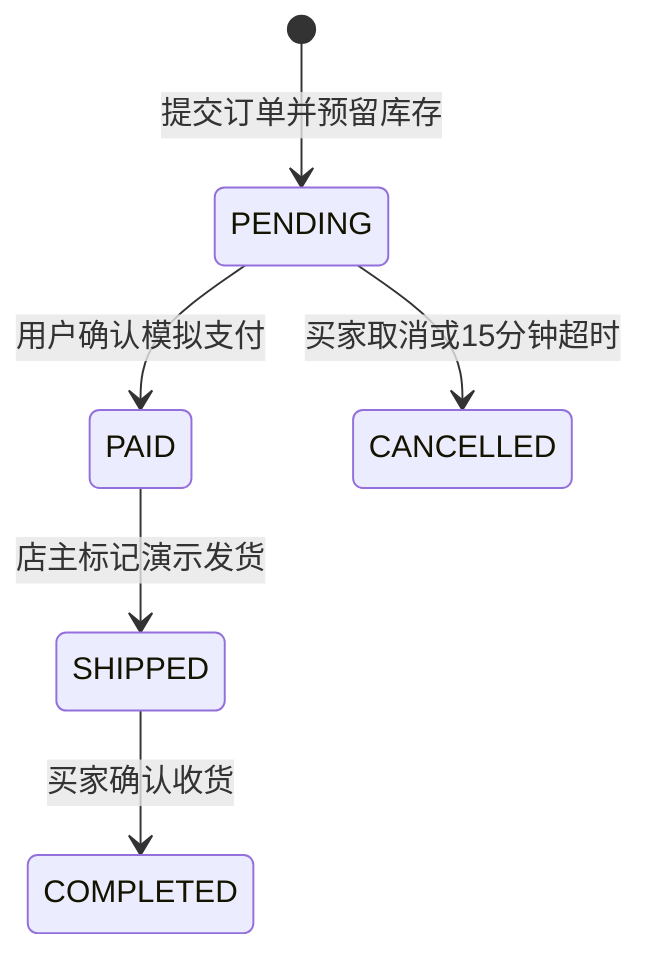
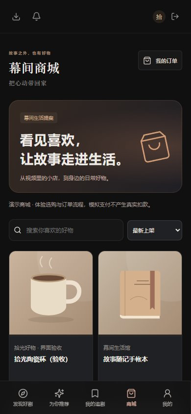

# 商城、店铺与视频带货使用说明

> 本文保留首版交付记录。购物车、地址簿、多商品批次结算、商品参数相册、订单动态和多规格组合已在后续增量交付；最新能力见[商城详版说明](11-商城详版购物车与地址说明.md)与[多规格说明](13-多规格商品与库存.md)。

本轮交付日期：2026-10-03。新增独立商城、个人开店、商品管理、视频挂载和订单闭环。所有购买均为**演示订单**，没有真实扣款或寄送；当前 App 仍以可安装 PWA 交付。

## 从哪里开始

| 想做什么 | 入口 | 实际效果 |
| --- | --- | --- |
| 逛商城 | 底部/侧边「商城」，`#mall` | 商品图、名称、价格、店铺；搜索；最新/价格升降序 |
| 买商品 | 商品卡 → 商品详情 → 立即购买 | 确认数量、收货人、电话和地址，提交待付款订单 |
| 查订单 | 我的 → 我的订单，`#orders` | 全部/待付款/待发货/待收货/已完成/已取消筛选 |
| 开店 | 我的 → 我的店铺 / 开店，`#merchant` | 店名、头像链接、简介和演示规则确认；一人一家店 |
| 管商品 | 我的店铺 → 商品管理 | 新增、编辑、上下架、库存管理、店铺预览 |
| 发视频 | 我的 → 视频带货，`#merchant/videos` | 视频标题、简介、封面链接、视频链接、分类、最多6件本店商品 |
| 从视频购物 | 播放器视频下方 | 小商品卡显示图片和价格；商品袋展开；进店或打开详情 |
| 发货 | 我的店铺 → 店铺订单 | 本店待发货订单可标记演示发货；买家之后确认收货 |

手机底部为五个主入口：发现好剧、为你推荐、我的追剧、商城、我的。人气榜单和管理员内容管理在「我的」内仍可访问；观看历史在个人片单中保留。

## 五分钟演示

1. 打开商城，浏览「幕间生活馆」四件演示商品。商品图为仓库自有 SVG 插画。
2. 打开发现页的「等风，也等你」，视频下方有商品卡；展开商品袋或点「进店」。
3. 用普通账号登录（可用 `demo / Demo123!`），购买一件商品，使用**虚拟收货信息**。
4. 到「我的订单」点击「模拟支付」；订单变为待发货，界面明确提示未发生真实扣款。
5. 用 `admin / Admin123!` 登录，进入我的店铺 → 店铺订单，对应订单点「演示发货」。
6. 切回买家账号，刷新订单、确认收货。不要用管理员内容管理中的短剧编辑替代店铺入口。

也可注册两个中文账号，一个开店、添加商品、发布视频，另一个下单。示例店只在开启 `SEED_DEMO` 且管理员还没有店铺时初始化，后续重启不恢复库存、不覆盖商品。商品和订单保存于 MySQL。

## 订单与库存规则

- 下单数量为1–99，价格由服务端读取；订单保存商品名称、图片、单价和收货信息快照，商品后续编辑不影响旧订单。
- 相同买家和请求标识只生成一个订单、扣一次库存；同一标识换内容返回中文冲突。
- MySQL 行锁保护库存，多个买家同时抢购不会将库存扣为负数。取消与超时只返库一次。
- 待付款保留15分钟；定时任务每30秒处理最多100个到期订单，停机期间的逾期订单会在重启扫描后处理。点击模拟支付时也检查是否过期。
- 编辑商品使用版本校验，防止旧表单把刚发生的下单/返库覆盖。提示冲突后关闭表单，点店铺「刷新」再编辑。
- 买家只能操作自己的订单，店主只能操作本店商品、视频和发货。商品下架后不会出现在新获取的商城和视频商品列表，旧卡片继续购买也会被服务端拒绝。
- 已创建的订单保留交易快照；商品之后下架不删除该订单，也不自动取消已有待付款订单。已付款订单不能使用未付款取消接口，当前无退款功能。
- 商品列表与订单列表当前各最多100条。视频最多挂载6件商品，无购物车和多商品合单。

## 实现位置

| 层 | 文件/表 | 职责 |
| --- | --- | --- |
| 用户界面 | `Commerce.tsx`、`commerce.css` | 商城、店铺、详情、结算、订单、播放器小卡片 |
| 商家界面 | `Merchant.tsx` | 开店、店铺资料、商品、发布视频、商品挂载、发货 |
| 集成入口 | `main.tsx`、`Profile.tsx`、`Player.tsx` | 路由、五项移动导航、个人购物入口、视频商品袋 |
| 店铺 API | `StoreController` | 查询、资源 URL 校验、归属校验、发布与挂载事务 |
| 订单 API | `OrderController` | 中文字段校验、身份注入、模拟支付/取消/发货/收货入口 |
| 订单业务 | `CommerceOrders` | 金额快照、事务与锁、幂等、状态迁移、到期返库 |
| 示例数据 | `CommerceDemoData` | 仅演示模式初始化小店、商品和示例视频挂载 |
| 五张新表 | `shop / shop_product / shop_video / drama_product / shop_order` | 首版合计21张表，原16张表保留；详版历史28张，评价后29张，规格与属性矩阵后35张，规格配图后36张 |

公开 GET：`/api/mall/products`、`/api/mall/products/{id}`、`/api/mall/shops/{id}`、`/api/dramas/{id}/products`。其余店铺、购买、订单接口需要 JWT；`/api/admin/**` 继续仅管理员可用。公开字段不包含收货信息、买家信息或店主账号。

下单：`POST /api/products/{id}/buy` 接收 `quantity, recipient, phone, address, requestKey`。商品编辑接收当前 `version`。买家动作在 `/api/me/orders/{orderNo}/{demo-pay|cancel|complete}`；发货在 `/api/shop/orders/{orderNo}/ship`。

## 实际验收

- `node scripts/verify-commerce.mjs`：44项，包含不同买家并发争抢、相同请求重试、越权、状态顺序、库存返还、视频归属、事务回滚、下架、商品版本冲突。
- `node scripts/verify-commerce-boundaries.mjs`：8项，真实数据库调早**专用验收订单**的到期时间，验证定时取消、过期支付、关店过滤、大额订单精度。需 `MYSQL_CLI`、`DB_PASSWORD`，可选 `DB_HOST/DB_PORT/DB_USER/DB_NAME`；这些值必须对应验收服务的数据库，不用于生产库。
- `node scripts/verify-commerce-ui.mjs`：24项，真实浏览器完成开店、商品、挂载、买家下单、店主发货、确认收货；390px和320px无页面横向溢出、五项移动导航、无未处理脚本异常。
- 原基础40项、分集28项回归通过。总计144项。
- Linux/WSL 完成 TypeScript、Vite 和 Maven 构建。沿用 Windows 上已有 MySQL 数据和本机 Java 服务；因 WSL 无法直连 Windows 回环地址，本轮 HTTP/浏览器测试在本机执行。
- 验收账号和订单保留用于复查；临时商品下架，临时视频删除。截图中的店铺/用户名为虚拟验收数据。

| 桌面商城 | 手机商城 | 视频商品卡 |
| --- | --- | --- |
|  |  |  |

[开店](screenshots/commerce/desktop-register-shop.jpg) · [商家商品](screenshots/commerce/desktop-merchant.jpg) · [店铺页面](screenshots/commerce/desktop-store.jpg) · [结算](screenshots/commerce/mobile-checkout.jpg) · [买家订单](screenshots/commerce/mobile-order.jpg) · [商家订单](screenshots/commerce/desktop-shop-orders.jpg) · [320px商城](screenshots/commerce/mobile-320-mall.jpg) · [个人中心](screenshots/commerce/mobile-390-profile.jpg)

## 当前边界与后续

已实现的是本地可体验的购物与视频带货闭环。购物车、地址簿、批次结算、属性矩阵多规格和规格配图已经交付；尚未接入微信/支付宝、真实物流、商家认证审核、退款售后、优惠券、平台抽佣或结算。发视频当前使用可访问链接，不含本地大视频上传、转码或内容审核；店铺及商品图片使用链接，头像背景原有上传能力独立保留。

下一阶段按顺序完善：店铺合单与商品图上传 → 支付及退款 → 商家资质/商品审核 → 物流轨迹及售后 → 创作者选品佣金和商家经营分析。实施真实支付前应把演示接口与生产支付渠道隔离，并加入签名验签、支付回调幂等与对账；实际状态事件已在详版落地。详见增强后总需求和总架构。
