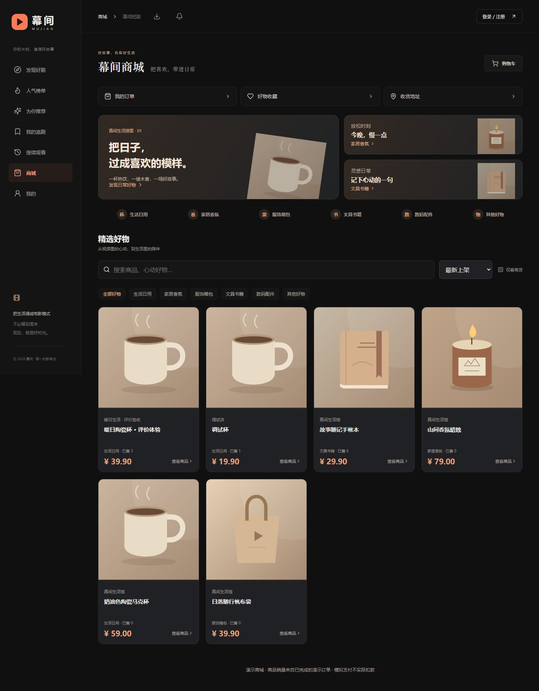
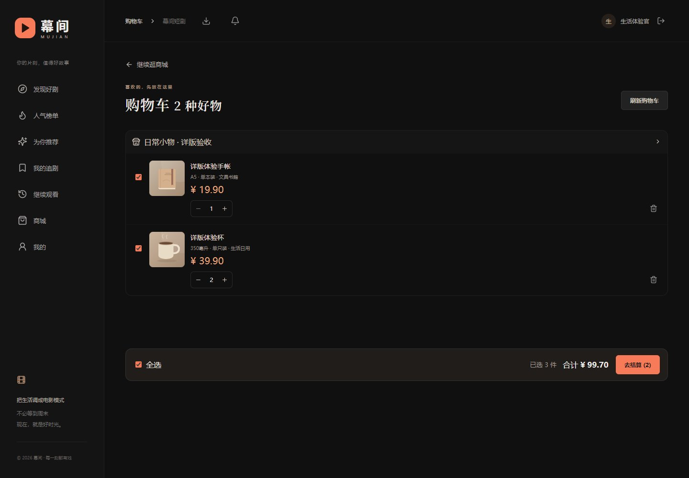
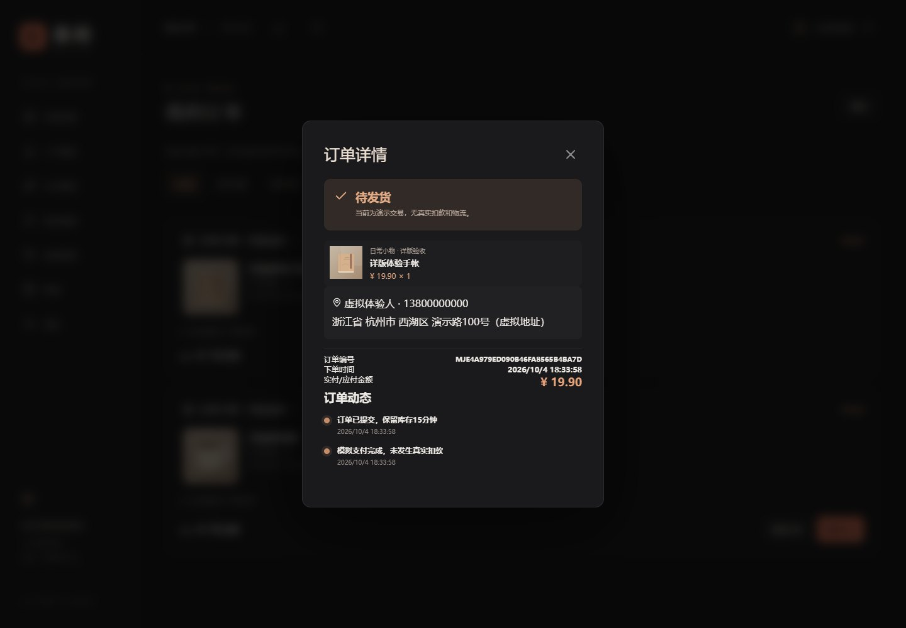

# 商城详版：选购、购物车与订单说明

2026-10-03 本轮更新。在原有商城和视频带货基础上，参考抖音的逛购路径与信息组织，同时保留红果方向的轻量观剧入口。这里描述实际完成的功能；不声称已经复制两款产品的全部能力。

2026-10-04增量：商品评价已经交付，支持本人已完成订单的1–5星、文字、每单一次、复购及下架后评价；商品详情公开评分汇总与最近100条。[评价需求、架构和验收](12-商品评价闭环.md)。以下保留购物详版主体及首轮验证记录，最新总表数为29，最新verify-shopping.mjs为68项。

## 这次打开商城有什么不同

| 模块 | 用户能看到和使用的内容 | 入口 |
| --- | --- | --- |
| 商城首页 | 生活场景推荐、六类入口、关键词搜索、最新/价格/销量排序、仅看有货、分页加载 | `#mall` |
| 商品详情 | 主图和最多6张附加图、材质、规格说明、产地、发货地、详细文字介绍、实际演示销量 | 点击商品 |
| 好物收藏 | 收藏/取消、独立好物片单、账号同步；与短剧收藏分开 | 商城快捷入口、我的 |
| 购物车 | 按店铺展示、勾选/全选、增减数量、删除、失效商品提示、合计金额、固定结算栏 | `#cart` |
| 收货地址 | 新增、编辑、删除、家/公司/其他标签、默认地址、结算时直接选择 | `#addresses` |
| 立即购买 | 自动填充默认地址，仍可手填；校验确认时价格 | 商品详情 → 立即购买 |
| 多商品结算 | 在结算窗口添加地址、按选中商品创建订单、失败整批回滚、成功仅移除选中商品 | 购物车 → 去结算 |
| 订单详情 | 收货信息、金额、编号、下单时间、付款截止时间、真实发生的状态动态 | 点击订单商品区域 |
| 商家编辑 | 分类、材质、规格、产地、发货地、4000字详情、每行一张相册链接 | 我的店铺 → 编辑商品 |

移动端搜索和分类提前，场景推荐压缩高度；320px/390px可用。商品仍使用现有深色暖橙风格。分类、销量和库存来自服务端；没有伪造评分、评价、限时折扣或销量。

## 数据与交易规则

### 商品与浏览

六类为生活日用、家居香氛、服饰箱包、文具书籍、数码配件、其他好物。默认24件一页，接口可请求1–100件并指定页码；商品相册只接受已有资源规则允许的HTTP/HTTPS或/media/链接。商家保存商品与详情在同一事务中，非法分类或相册链接不会留下半份编辑。

“已售”仅统计已完成的演示订单数量。现阶段规格是商家填写的一段说明，**不是颜色/尺寸等独立SKU选择**。价格区间筛选已有API校验，页面当前提供价格排序与有货筛选。

### 购物车与收藏

购物车每账号最多100种商品，每种1–99件；加入购物车不锁库存。购物车读取最新商品价格、上下架及店铺状态，失效商品保留以便删除。库存少于购物车数量时不能勾选结算；有剩余库存时，点击减少直接调整至可购买数量，避免数量卡在超量状态。好物收藏最多200件；重复收藏幂等，账号间隔离。

### 地址

每账号最多20个地址。首个地址自动默认，新增/修改默认使用用户行锁串行化，保证并发操作后只有一个默认地址。删除默认地址后自动选择一条剩余地址；删除或修改地址不更改已有订单的收货快照。默认地址不能简单取消成“没有默认”，可在另一地址上设置默认。

### 多商品结算

1. 最多同时选20种商品。前端提交地址ID、商品ID、数量、确认时单价和一个请求标识。
2. 后端锁买家、检查请求标识，按商品ID升序锁商品，校验购物车数量、当前价格、库存、在售状态和店铺状态。
3. **任一商品不满足条件，整个结算失败，不扣库存、不删购物车、不留下部分订单。**
4. 全部通过后写结算批次，复用订单服务创建独立订单，保存收货/商品/价格快照，并删除本次选中的购物车条目。
5. 相同请求标识和相同内容重试返回原批次，不会重复扣库存；内容改变则返回中文冲突。即使原地址已删除，重试仍能拿到原订单。

当前按**商品**拆成独立订单，并非按店铺合成一个多行订单；每笔分别执行模拟付款、演示发货和收货。结算窗口明确显示拆单数量。运费固定显示演示运费0元，不代表真实包邮政策。

订单仍预留15分钟，超时或取消返还库存。真实资金接入前，支付、发货全部保持演示标识。

### 订单动态

新订单和后续状态变化在同一事务中追加事件。重复付款/收货不追加重复事件。超时取消区分于买家主动取消。旧订单不伪造早期时间线：未记录的历史不补写，可显示当前状态及后续真实事件。

## 技术实现

新增 `ShoppingController`、`ProductDetails`、`ShoppingDemoData`；扩展原 `StoreController`、`CommerceOrders`、`OrderController`。前端新增 `Shopping.tsx` 和 `shopping.css`，保留并扩展 `Commerce.tsx` / `Merchant.tsx`。地址编辑弹窗通过React Portal放在页面根部，避免结算表单嵌套提交。

新增7张表，合计28张；启动使用CREATE TABLE IF NOT EXISTS，不破坏原订单。

| 表 | 用途/约束 |
| --- | --- |
| shop_product_detail | product_id主键；分类、材质、规格、产地、发货地、详情、JSON相册 |
| shopping_cart | user_id/product_id组合主键；数量1–99 |
| shipping_address | 地址归属、标签、默认标记；默认唯一由用户锁与事务保证 |
| product_favorite | user_id/product_id组合主键；独立于短剧收藏 |
| checkout_batch | buyer_id/request_key唯一；确认内容的SHA-256指纹 |
| checkout_batch_item | 批次和订单关系；order_no唯一，防止重复关联 |
| shop_order_event | 按订单记录状态、说明和时间，订单ID索引 |

主要接口：

- `GET /api/mall/products`：q、category、sort、inStock、page、size、minPrice、maxPrice。
- `GET /api/me/cart`，`POST/PUT/DELETE /api/me/cart/{productId}`。
- `POST /api/me/cart/checkout`：addressId、items、requestKey。
- `GET/POST /api/me/addresses`，`PUT/DELETE /api/me/addresses/{id}`。
- `GET /api/me/product-favorites`，`PUT/DELETE /api/me/product-favorites/{id}`。
- `GET /api/me/orders/{no}`、`GET /api/shop/orders/{no}`：按买家/店主校验归属，返回事件。
- 商品写入新增可选details对象，旧客户端不传时保留已有扩展资料。立即购买新增expectedPrice校验；旧客户端仍可使用原请求。

购物车加购/修改、地址变更、结算使用用户锁；结算按商品ID锁定以降低死锁风险。价格使用BigDecimal；整个批次与订单操作共享事务。数据库与HTTP边界验证见验收脚本。

## 如何演示

1. 在商城点「家居香氛」或「文具书籍」，排序或切换有货筛选。
2. 打开商品，查看参数、点击相册小图、收藏并加入购物车。
3. 再加入另一件商品，在购物车调整数量、勾选部分商品。
4. 点去结算 → 新增地址，填写虚拟收货信息；保存地址后仍停留在确认订单。
5. 确认金额与拆单数量，提交演示订单，分别模拟支付。
6. 点击订单的商品区域查看时间线。我的 → 我的店铺可填写更丰富的商品参数和图片。

## 验收证据

`node scripts/verify-shopping.mjs`：46项接口检查，包括分类分页、详情事务、相册地址校验、购物车和地址隔离、默认地址并发、整批失败不扣库存、并发结算幂等、删除地址后的重试与快照、订单事件和销量。

`node scripts/verify-shopping-ui.mjs`：32项真实浏览器检查，包括商家编辑参数/相册、筛选、多图、收藏、加购、数量合计、库存骤降后的数量调整、结算内新增地址、拆单、时间线、地址编辑及默认填充、320/390px布局。环境同前轮：Linux完成前后端构建，沿用本机Java/MySQL与Edge进行联网验收。

原商城API44项、基础API40项、视频带货浏览器24项、订单数据库边界8项回归通过，本轮共194项。浏览器截图使用虚拟验收账号、商品和收货信息；临时商品验收后下架，演示店铺原有四件商品继续保留。

| 桌面商城 | 购物车 | 订单详情 |
| --- | --- | --- |
|  |  |  |

[商品详情](screenshots/shopping/desktop-product.jpg) · [结算](screenshots/shopping/desktop-checkout.jpg) · [商家详情表单](screenshots/shopping/desktop-merchant-details.jpg) · [390px商城](screenshots/shopping/mobile-390-mall.jpg) · [320px购物车](screenshots/shopping/mobile-320-cart.jpg) · [320px结算](screenshots/shopping/mobile-320-checkout.jpg) · [地址管理](screenshots/shopping/mobile-390-addresses.jpg)

## 后续范围

当前未包含多SKU、店铺合单、优惠券、真实运费模板、真实支付/物流/售后、商家认证及本地视频上传。商品文字评价已在2026-10-04交付；图片、追评、商家回复及评价审核仍待扩展。下一步可围绕规格库存、支付退款和履约继续细化。参考竞品的是用户路径与信息层次，现有能力及边界以这里的验收结果为准。
