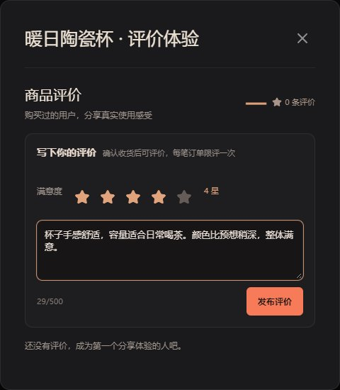
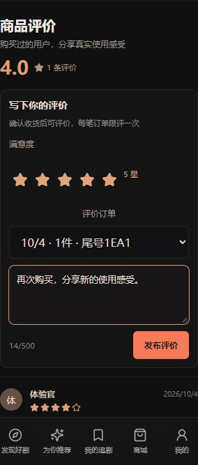

# 商品评价闭环：需求、架构与验收

交付日期：2026-10-04。延续抖音式选购路径，在现有模拟订单之上加入收货后的文字评分，不额外增加个人主页入口。当前仍是可安装PWA及演示交易，评价来自用户实际完成的**演示订单**，不代表真实商品销量或商业购物口碑。

## 用户可以做什么

| 能力 | 实现状态和实际效果 | 入口 |
| --- | --- | --- |
| 浏览评价 | 平均分保留1位小数、总评价数、最近100条可见评价；昵称、头像、星级、日期及正文 | 商品详情下方 |
| 收货后评价 | 用户主动选择1–5星，填写1–500字；全空白不能提交 | 我的订单 → 已完成 → 评价商品 |
| 复购按单评价 | 每单每件商品限一次；不同已完成订单可分别评价 | 商品页/订单弹窗内选择日期、件数、订单尾号 |
| 下架后评价 | 原订单仍可评价，无需重新进入已下架商品详情 | 我的订单 |
| 查看已评状态 | 发布后订单按钮变为“查看评价”，待评价列表移除该订单 | 已完成订单 |
| 中文失败与重试 | 网络错误、评分/正文校验、权限、重复提交都有中文提示；提交失败保留评分与正文 | 评价区域 |
| 手机与键盘 | 320/390px布局、原生单选评分支持方向键；弹窗复用现有焦点管理 | 手机浏览器/PWA |

无评价显示横线和“暂无评分”，不生成示例好评或默认选中五星。公共评价不返回订单编号、收货资料或买家ID。无待评资格与资格读取失败是两种不同状态，失败时提供重试。

## 三分钟演示

1. 买家选择商品，下演示订单并点击模拟支付。
2. 店主在「我的店铺 → 店铺订单」演示发货。
3. 买家在「我的订单」确认收货，点击新出现的「评价商品」。
4. 选择星级、填写体验、提交。弹窗显示新评价，订单变为「查看评价」。
5. 回到商品详情，或退出登录再次进入，查看公开评价与平均分。
6. 同一商品复购收货后可选另一笔订单评价；店主下架商品后，买家仍通过已完成订单评价。

| 桌面发布 | 320px复购评价 | 320px订单弹窗 |
| --- | --- | --- |
|  |  |  |

[公开评分与评价](screenshots/reviews/desktop-product-reviews.jpg) · [390px](screenshots/reviews/mobile-390-reviews.jpg) · [中文失败保留输入](screenshots/reviews/desktop-review-retry.jpg)。截图均使用虚拟验收账号、订单和商品。

## 数据与技术架构

保持 React + Spring Boot + MySQL 单体和同源部署。只增加一张 `product_review` 表，合计29张表；使用增量建表，保留已有用户、店铺及订单数据。

| 字段/约束 | 含义 |
| --- | --- |
| id / product_id / buyer_id / order_no | 主键及商品、买家、订单关系；全部有外键 |
| rating | 1–5星，数据库CHECK与HTTP校验 |
| content | 最多500字，不能为空白；存储前裁剪首尾空白 |
| status / create_time | VISIBLE/HIDDEN及创建时间；HIDDEN仅预留数据状态 |
| UNIQUE(order_no,product_id) | 同一订单同一商品只评一次 |
| INDEX(product_id,status,create_time) | 按商品、可见性和时间读取 |

`ProductReviewController.create` 在事务中：从JWT取用户 → `FOR UPDATE`读取该用户订单 → 校验商品和COMPLETED → 当前读检查是否已评价 → 插入 → 返回可公开字段。并发提交由订单行锁串行化，数据库唯一约束兜底；五个并发请求实测一次201、四次409。评分聚合与最近列表在只读事务中读取，使用同一数据库快照。

`CommerceOrders` 的查询增加 `reviewed`，不修改既有支付、发货或收货流程。`ProductReviews` 同时用于商品页和订单Modal；订单入口携带待评订单号，复购时准确预选。前端分别管理评价列表和待评资格请求，发布成功后刷新二者及订单状态。

## 接口契约

| 方法与路径 | 权限 | 返回/规则 |
| --- | --- | --- |
| GET `/api/mall/products/{productId}/reviews` | 游客可读 | items、reviewCount、averageRating；最近100条，统计所有可见评价；商品不存在404 |
| GET `/api/me/products/{productId}/reviewable-orders` | 当前用户 | 最多20条本人COMPLETED且未评订单，返回orderNo、quantity、createTime |
| POST `/api/me/products/{productId}/reviews` | 当前用户 | rating、content、orderNo；成功201，非法输入400，归属/商品不符404，未收货/重复409 |

```json
{
  "rating": 4,
  "content": "手感舒适，颜色比预想稍深，整体满意。",
  "orderNo": "从本人待评价接口取得的实际订单编号"
}
```

公开GET路径明确加入Spring Security白名单；个人GET/POST继续要求JWT。商品下架后保留评价读取与订单评价能力；公开商品详情仍沿用原来的下架不可访问规则。

## 实际验收

2026-10-04共206项通过：

| 检查 | 结果 |
| --- | --- |
| `node scripts/verify-shopping.mjs` | 68项：原购物46项加评价22项，含游客读写边界、中文校验、账号隔离、商品对应、未收货、重复、并发、复购平均分、下架评价、公开信息保护 |
| `node scripts/verify-reviews-ui.mjs` | 22项：登录、收货入口、键盘评分、空白拦截、失败保留、两类请求重试、复购选单、320/390px、下架后发布、退出后公开读取 |
| `node scripts/verify-shopping-ui.mjs` | 32项：原购物车、地址、多商品结算、商家表单和小屏回归 |
| `node scripts/verify-commerce.mjs` | 44项：原店铺、商品、订单、库存与视频挂载回归 |
| `node scripts/verify.mjs` | 40项：原账户、短剧、互动、权限和PWA资源回归 |

TypeScript/Vite和Maven生产构建通过。Maven没有Java单元测试，后端行为由真实MySQL及HTTP检查覆盖。浏览器使用本机Edge无头模式；设置 `PLAYWRIGHT_MODULE` 指向已安装Playwright，`CHROMIUM_PATH` 指向浏览器可复验，`APP_URL`可更改服务地址。

优先尝试Ubuntu WSL，但本轮启动仍报 `HCS/0x800705aa`，使用已有Windows Node/Java/Maven完成构建和运行，未声称本轮Linux构建成功。验收临时商品下架，账号与完成订单保留用于复查；不修改用户原有商品、订单。

## 后续需求与架构

尚未实现图片评价、追评、商家回复、评价举报审核、评价分页/评分筛选，也没有真实支付、物流或售后。这些不计入本轮完成范围。

- 评价治理：增加评价举报、处理记录、审核角色权限和审计；隐藏和恢复必须记录原因，评分随可见状态变化重新聚合。
- 图片和追评：独立评价媒体表与追评表，限定次数/时限；资源复用上传校验及对象存储流程，禁止把公开链接当作审核完成。
- 商家回复：根据订单店铺校验回复归属，独立保存回复及修改记录；不得允许店主修改买家评分。
- 数据规模：新增游标分页、分数分布与筛选；聚合缓存需要在新增/审核时同步失效，保持评分与可见评价一致。

当前/后续总需求见[03](03-当前产品需求.md)、[05](05-增强后总需求.md)；当前/后续总架构见[04](04-当前技术架构.md)、[06](06-增强后总技术架构.md)。
