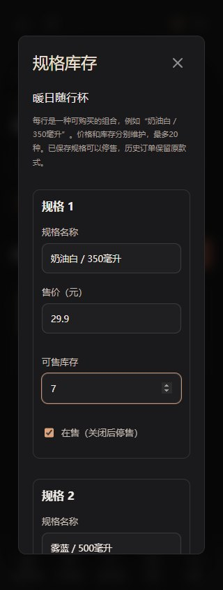

# 多规格商品与库存：需求、架构与演示

交付日期：2026-10-05。延续抖音式“看视频 → 看同款 → 选规格 → 下单”的路径，补齐颜色、容量等独立属性矩阵、组合价格与库存。保留原短剧、追剧和个人主页，不新增个人页杂项。当前产品仍是可安装PWA，支付与发货为演示。

## 需求实现情况

2026-10-07 配图增量：属性组合和自由规格均支持独立图片链接与预览，重复生成组合保留已填图片。选款同步商品主图和当前款式预览，购物车按款显示图片；订单保存下单时的图片地址，后续编辑不改写历史地址。空图片沿用商品主图，旧客户端省略字段保留原图。[规格配图、接口与上线效果](15-规格配图与订单图片快照.md)。

2026-10-07 修复：买家从“奶油白/350毫升”切换“雾蓝/500毫升”时，即使没有交叉款也可点击有货属性；新选择优先，冲突的旧属性自动清空，重新选完整后才能加购。商家反复生成组合按属性组顺序匹配草稿，不再将 `[-1,-2]` 与 `[-2,-1]` 合并；增加属性组将原 SKU 数据保留到第一个兼容组合，其余新组合库存为 0。

服务端要求每个组合的属性值顺序与 `groups` 一致，按值比较编号并拒绝错组/重复属性；首次启用矩阵复用旧规格未付款订单保护，失败由事务完整回滚。验收为 API 18、浏览器 15、旧规格 API 43，共 76 项通过，见 [本轮记录](08-本轮验收记录.md)。

| 需求 | 实现效果 | 入口 |
| --- | --- | --- |
| 店主配置属性矩阵 | 每件商品最多3组属性、每组10个值、20种组合，可分别设置价格、库存、在售/停售 | 我的 → 我的店铺 → 商品的「属性组合」 |
| 买家明确选款 | 先选颜色、容量等属性后解析具体组合；未完成或无库存时不能加购/购买 | 商城或视频同款 → 商品详情 |
| 卡片价格不误导 | 商品卡、视频下方小卡及商品袋显示最低在售价加「起」 | 商城/视频播放器 |
| 同商品多款一起买 | 两种规格作为独立购物车行，分别勾选、改数量、移除和结算 | 购物车 |
| 订单看清买了哪款 | 立即购买弹窗、订单卡及详情显示购买时规格；改名改价不影响旧单 | 确认订单/我的订单/店铺订单 |
| 防止库存错扣 | 只扣选中款式；取消、15分钟到期返还原款式；重复请求只执行一次 | 服务端事务 |
| 旧数据保留 | 未设规格的商品继续原流程；旧订单可查看；启用规格后旧购物车行保留但不可结算，可移除后重新选款 | 原商品/订单/购物车 |
| 手机操作 | 320/390px选款、购物车及商家表单适配，中文校验和失败提示 | 手机浏览器/PWA |

当前支持独立属性组（例如颜色、容量）和自动生成组合；每个组合仍落在原有 `product_variant` 中，因此旧商品、购物车和订单保持兼容。旧的自由填写组合规格继续可用；已保存属性和值不能物理删除，已有组合只能编辑或停售。属性矩阵最多3组、每组10个值、20种组合。

## 三分钟演示

1. 打开商城，搜索「幕间随行杯 · 多规格演示」，进入详情。
2. 选择「奶油白 / 350毫升」，看到¥49和独立库存；切到「雾蓝 / 500毫升」变为¥59。「曜石黑 / 500毫升」初始库存为0，显示售罄。
3. 分别把白色、蓝色加入购物车。两行独立显示名称、单价和数量；可以只选择其中一款。
4. 选地址提交演示订单，查看各款的订单快照。当前按商品/规格生成独立订单，同店也不合并为一个多行订单。
5. 取消一笔未付款订单，再看商品库存，只有对应款式返库。
6. 店主在「我的店铺 → 规格库存」编辑自己的商品。保存前若发生购买、返库或其他编辑，旧版本会被拒绝，需要关闭并刷新后重试。

演示商品由 `VariantDemoData` 在开启演示种子时单独创建，初始白色12件、蓝色8件、黑色0件。只在指定演示店铺不存在同名商品时创建；重启不会重置已发生变化的库存。旧四件演示商品保持原配置。截图使用独立虚拟验收商品，名称、价格与长期演示商品不同。

| 手机选择规格 | 手机多款购物车 | 手机商家配置 |
| --- | --- | --- |
|  |  |  |

[桌面选款](screenshots/variants/desktop-product-variants.jpg) · [桌面商家配置](screenshots/variants/desktop-merchant-variants.jpg) · [桌面购物车](screenshots/variants/desktop-variant-cart.jpg) · [订单规格快照](screenshots/variants/desktop-variant-order.jpg)。

## 数据与事务

保留 React + TypeScript + Spring Boot + MySQL 单体和同源部署。原29张表不删改，规格矩阵及配图共增加7张表，配图阶段共**36张表**（上传增量后37张）：

| 新表 | 作用与约束 |
| --- | --- |
| `product_attribute` | 商品属性组，例如颜色、容量；同商品名称唯一，最多3组 |
| `product_attribute_value` | 属性值，例如奶油白、500毫升；同组值唯一，最多10个 |
| `product_variant_value` | 组合规格与属性值的映射；组合由服务端校验唯一性 |
| `product_variant_image` | variant_id 唯一，保存规格/组合图片；空值沿用商品主图 |
| `product_variant` | 商品外键、规格名称、DECIMAL价格、非负库存、在售状态；按product_id索引 |
| `variant_cart` | user_id/variant_id联合主键，账号隔离；数量1–99，独立更新时间 |
| `order_variant` | order_no主键，一订单一规格；保存variant_id和购买时variant_name；规格外键RESTRICT |

旧 `shopping_cart` 和 `shop_order` 的原数据继续可用。订单查询LEFT JOIN新规格快照，无规格时skuId为null。`ProductVariants` 负责规格接口、归属校验、选款与汇总库存；`CommerceOrders` 复用选款和返库规则；`ShoppingController` 合并读取两类购物车。前端 `Variants.tsx` 提供选择器与商家表单，复用于原有商品详情/店铺页面。

关键规则：

- 写操作先锁父商品，再读取/锁规格；所有购买、编辑和返库共享这一入口，避免两款各自修改后覆盖商品汇总。批量结算按商品ID、规格ID排序加锁。
- 商品汇总库存是所有在售规格库存之和；起价是最低在售规格价格，包含仍在售但售罄的规格。若全部停售，保留最低配置价格但可售库存为0。卡片起价不保证对应款式有库存，详情始终展示各款真实状态。
- 店主保存要求父商品version一致；保存、购买和返库都会更新版本。常规商品编辑不能直接覆盖多规格商品的价格和库存，应使用「规格库存」。
- 启用规格前若存在未付款旧款订单，返回409。保存规格使用READ_COMMITTED，在持有商品锁时检查已提交的旧单状态，不额外锁订单，避免与取消订单的锁顺序形成循环。
- 下单使用服务端规格价格，必须传expectedPrice确认；skuId必须属于此商品且在售。错误价格、停售、短缺均返回中文冲突，不扣库存。
- 取消/到期通过order_variant找到原规格，停售或改名后依然返还该规格；订单状态锁防止重复返还。历史名称和成交价独立于当前商品。
- 幂等判断含skuId；同一请求键换款不能复用原结果。购物车批次指纹对新款包含skuId，对原单规格保持旧格式，兼容原请求重试。
- 同商品不同规格可以在一批中提交；同商品同规格不能重复。全部价格/数量/库存/地址验证通过后统一落单，任何失败回滚整批。

## 接口契约

| 方法与路径 | 新增/变化 | 权限与边界 |
| --- | --- | --- |
| GET `/api/shop/products/{id}/variants` | 返回version、items | 当前有效店铺的商品所有者 |
| PUT 同上 | 提交version和完整items | 1–20条；名称去首尾空白后不能重复；原有ID全部保留；合计配置库存≤999999 |
| GET `/api/mall/products/{id}` | 新增variants、hasVariants | 游客可读在售商品；返回停售/售罄项供展示，前端禁止选择 |
| POST `/api/products/{id}/buy` | skuId、expectedPrice | 多规格必须明确选择并确认价格；数量1–99 |
| POST/PUT `/api/me/cart/{id}` | quantity、可选skuId | 无skuId为旧默认款；多规格不能绕过选款 |
| DELETE `/api/me/cart/{id}?skuId=...` | 只移除对应规格 | 不传skuId只处理旧默认行 |
| GET `/api/me/cart` | 每行新增skuId、variantName | 两类购物车合计最多100种，规格价格/库存独立 |
| POST `/api/me/cart/checkout` | items每项增加可选skuId | 一次最多20种商品/规格，按商品/规格拆单 |
| GET `/api/me/orders`、订单详情、店铺订单 | skuId、variantName | 保持原买家/店主权限 |

配置请求示例（已有规格的id和version应取自GET，不能照抄）：

```json
{
  "version": 0,
  "items": [
    {"name": "奶油白 / 350毫升", "price": 49, "stock": 12, "onSale": true},
    {"name": "雾蓝 / 500毫升", "price": 59, "stock": 8, "onSale": true}
  ]
}
```

## 后续可完善的需求与架构

1. 规格配图已交付：详情换图、当前款式预览、购物车和订单快照；商品图上传裁剪亦已交付，继续增加内容审核和素材管理。
2. 按店铺合单：引入order/order_item，迁移当前每规格一单模型；分别保存规格、单价、运费、优惠分摊和地址快照，支持部分取消/退款。
3. 库存账本：在当前行锁基础上增加库存预占记录和变动流水，区分可售、预占、实物库存；真实支付必须查单/关单后再释放预占。
4. 真实交易与履约：接支付回调验签、查单、退款、对账、物流和售后。现有模拟支付与真实资金渠道分离。
5. 商品治理：资质审核、图片上传和审核、规格停售解释、缺货提醒、评价筛选/图片/追评/商家回复。

[当前总需求](03-当前产品需求.md) · [当前总架构](04-当前技术架构.md) · [增强后总需求](05-增强后总需求.md) · [增强后总架构](06-增强后总技术架构.md) · [验收记录](08-本轮验收记录.md)。
