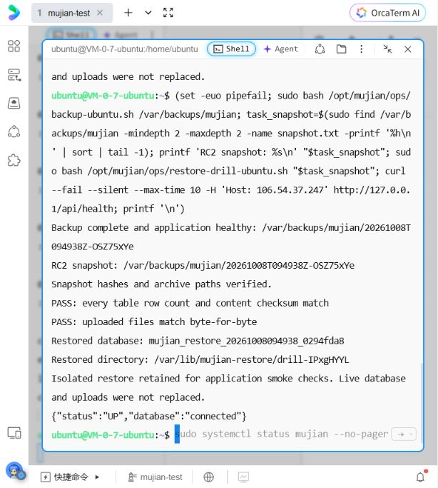

# Ubuntu 测试服务器部署

## 最新云端结果（2026-10-08）

在用户完成腾讯云和实例免密认证后，通过OrcaTerm操作上海Ubuntu24.04，上传RC2包并核对SHA256 `a4b0a7b1c04d8ea9a4aaf04f585eeb7e2365480e28127a4a6a1d28abfe9960d7`。源码标识 `5cfc3a7c47dfd58dc616c174ff6674d35201ff5a`，解包目录 `/home/ubuntu/mujian-rc2-update.zTi12jTy/mujian-release`。完整JAR与候选包cmp一致，JAR SHA256 `16d57a8d9983257be4be6b335465ae77a69e285f42f8286caa5fff7e704c29d9`。公网21项只读检查、6项前端文件核对通过，JS/CSS为 `index-3bxjKfCR.js` / `index-BcYMA0Je.css`。

升级前快照 `/var/backups/mujian/20261008T094447Z-8QdLPp64`；恢复到 `mujian_restore_20261008094819_2c41243a` 和 `/var/lib/mujian-restore/drill-F01HMr1s`。升级后RC2快照 `/var/backups/mujian/20261008T094938Z-OSZ75xYe`；恢复到 `mujian_restore_20261008094938_0294fda8` 和 `/var/lib/mujian-restore/drill-IPxgHYYL`。两次均校验每张表行数/内容和所有上传文件一致；线上数据库和上传目录未被替换。恢复目标保留供后续应用启动验证，本轮未在恢复库启动应用。

应用/MySQL/Nginx/备份timer均active，带 `Host: 106.54.37.247` 的本机Nginx检查为UP/connected。timer已启用，未观察每日任务真实触发。公网商品两款49元/59元、库存12/8及配图实测正常；没有新增交易账号、订单或修改库存。整机重启、登录业务复验、域名HTTPS和真机安装仍待完成。

RC2外层脚本最后请求 `http://127.0.0.1/api/health` 命中默认站点，发生JSON解析错误；应用升级已成功，正确Host复验和公网核对确认成功。仓库修复为必须传入PUBLIC_HOST，4项隔离流程测试通过；RC3包只有部署工具修复，App与云端RC2相同。RC2历史包保持原文件和校验和，勿把其尾部报错误判为JAR回退。



下面早期“未部署”的文字属于历史记录，以本节最新证据为准。

## 首版候选包与本地恢复演练

2026-10-08已冻结首版需求并完成本地Linux验收；新增一致性备份、隔离恢复演练与每日定时器工具，上传目录和数据库恢复匹配，恢复应用21项只读检查通过。当前用户暂无域名，先完成部署准备；本轮仍未连接服务器或配置HTTPS。旧的素材库预发布包不含新运维工具，请使用[首版候选包](https://github.com/Tony-XUYANG/mujian/releases/tag/first-release-rc2-20261008)。[范围与证据](18-首版冻结范围与交付验收.md)。

## 首版候选包的接续升级

以下三参数命令适用于已修复Host检查的[RC3包](https://github.com/Tony-XUYANG/mujian/releases/tag/first-release-rc3-20261008)。RC2历史包只接受两个参数并存在尾部Host检查问题，不再用于新的接续升级。

首版候选包内的 `verify-release.py` 会同时校验文件清单、SHA256 和 `SOURCE_COMMIT`，避免把旧包或改过的脚本交给 root 执行。已有上海服务器在网页终端完成登录后，先下载发布页的 `mujian-first-release-rc.tar.gz` 和校验文件，再执行：

```bash
sha256sum -c mujian-first-release-rc.tar.gz.sha256
tar -xzf mujian-first-release-rc.tar.gz
cd mujian-release
sudo bash apply-release-ubuntu.sh . 发布页列出的40位源码提交 106.54.37.247
```

脚本顺序是：校验候选包 → 使用新备份工具生成一致性快照 → 原子切换JAR并重启 → 检查 `UP/connected`。任一步失败都会停止；升级脚本保留上一JAR，可按本文件的回退命令恢复应用。执行后用 `APP_URL=http://106.54.37.247 node scripts/verify-deployment.mjs` 做只读检查，并另外完成登录、商品选款、模拟订单和图片素材的云端验收。未连接认证终端前不要把本地结果写成云端结果。

升级后还须核对版本，旧版本也可能通过全部健康检查：

```bash
# 在本地Ubuntu项目目录执行，frontend/dist须为选定候选包的构建产物
APP_URL=http://106.54.37.247 node scripts/verify-deployed-version.mjs
```

该脚本对比构建清单、首页、JS/CSS、SW及安装清单的SHA256，不写服务器业务数据。当前RC2预期JS为 `index-3bxjKfCR.js`，CSS为 `index-BcYMA0Je.css`；仅健康检查通过、资源仍为旧版时，不能标记升级完成。它只识别前端构建，完整JAR应另外在服务器执行 `cmp /opt/mujian/current.jar 候选包目录/mujian.jar`。

仓库还提供 `deploy/check-server-ubuntu.sh`（RC2包未内置该后续检查工具），在服务器以root执行可以核对JAR、三个服务、Nginx、健康接口及备份定时器；不读取环境密钥或账号密码。需要输出的是执行结果，无需发送 `/etc/mujian/app.env` 或登录密码。

首版包还提供 `nginx-https.conf` 模板。拥有已备案域名并解析到服务器后，先安装证书，再把 `__DOMAIN__` 替换为真实域名、执行 `nginx -t && systemctl reload nginx`，最后检查 HTTP 自动跳转、证书链、Service Worker、Android 添加到桌面和 iPhone 添加到主屏幕。完整操作和真机记录模板见[HTTPS与手机安装验收](19-HTTPS与手机安装验收.md)。没有域名时不要启用此模板，也不要用IP地址声称完成PWA安装。

## 2026-10-08：此前素材库预发布记录

本轮素材库在Linux构建完成，本地116项验收通过，新增 shop_media_details 后共38张表。**本轮没有更新云端**：当前工具无法操作此前登录的腾讯云网页终端，本机也没有已验证主机身份并可认证的SSH连接。没有跳过主机校验或修改SSH权限。

本地新资源是 index-CM0BtC9d.js / index-BcYMA0Je.css。以下2026-10-07的上传裁剪版是最近一次确认成功的云端部署，不能把本地新版本的检查记为云端验收。

源码提交 `d6666e00d5cc13225fbf32ad0e31f1b4d04c19b9`。已生成[Ubuntu测试预发布包](https://github.com/Tony-XUYANG/mujian/releases/tag/media-library-20261008)，包名 `mujian-media-library.tar.gz`，SHA256为 `914c7f18423ee642de7eabc6fd84af84ab7b022008ced6748eba69253a413ae6`。包内JAR、安装/升级脚本、systemd和Nginx配置逐一校验通过，SOURCE_COMMIT一致；不含本机数据库、账号或上传图片。源码与文档已推送公开仓库。

本轮还从Linux对现有公网版本执行只读检查21项通过，入口仍为 `index-Dch4hN0P.js` / `index-m5D5V1vq.css`，明确确认网站继续运行旧版，没有将它记作新素材库的云端验收。

### 已有上海测试服务器的接续操作

在腾讯云该实例的Ubuntu网页终端中执行下面这一段。它下载并校验预发布包、备份数据库与图片、再调用原有升级脚本。备份校验仅验证归档可读，不代表完成恢复演练；任何一步失败就停止后续步骤。此段已准备并完成shell语法检查，**本轮未在服务器执行**。

```bash
(
set -euo pipefail
task_update_dir=$(mktemp -d /tmp/mujian-media-update.XXXXXXXX)
cd "$task_update_dir"
curl --fail --location --retry 2 --max-time 180 \
  'https://github.com/Tony-XUYANG/mujian/releases/download/media-library-20261008/mujian-media-library.tar.gz' \
  -o mujian-media-library.tar.gz
printf '%s  %s\n' '914c7f18423ee642de7eabc6fd84af84ab7b022008ced6748eba69253a413ae6' 'mujian-media-library.tar.gz' | sha256sum -c -
tar -xzf mujian-media-library.tar.gz
(cd mujian-release && sha256sum -c SHA256SUMS)
sudo bash -s <<'BACKUP'
set -euo pipefail
umask 077
task_backup_dir=$(mktemp -d /var/backups/mujian/before-media-library-XXXXXXXX)
mysqldump --single-transaction --quick --no-tablespaces --routines --triggers mujian | gzip > "$task_backup_dir/database.sql.gz"
gzip -t "$task_backup_dir/database.sql.gz"
tar -C /var/lib/mujian -czf "$task_backup_dir/uploads.tar.gz" uploads
tar -tzf "$task_backup_dir/uploads.tar.gz" >/dev/null
readlink -f /opt/mujian/current.jar > "$task_backup_dir/application-path.txt"
(cd "$task_backup_dir" && sha256sum database.sql.gz uploads.tar.gz application-path.txt > SHA256SUMS)
printf 'Backup archive verified: %s\n' "$task_backup_dir"
BACKUP
sudo bash mujian-release/update-ubuntu.sh "$task_update_dir/mujian-release"
curl --fail --silent http://127.0.0.1/api/health
)
```

执行成功后刷新浏览器，在「我的店铺 → 图片素材」检查入口；新入口资源应为 `index-CM0BtC9d.js`。下一步仍需对云端进行素材库API和手机页面验收。更新只新增可选元数据表，旧JAR仍可读取既有业务表；应用回退不自动删新表，不把JAR回退当作数据库恢复。

### 备份与恢复演练

首版候选包加入了 `mujian-backup.timer`、`backup-ubuntu.sh` 和 `restore-drill-ubuntu.sh`。新安装和升级时会把脚本放到 `/opt/mujian/ops`，启用每天北京时间 04:00 的备份定时器。备份会短暂停止应用，使用数据库导出、表级行数与校验和、上传文件清单、上传归档和应用JAR组成完整快照；完成后自动启动应用并检查 `UP/connected`。备份失败会保留 `.partial-*` 目录，不会冒充成功快照。

```bash
sudo systemctl status mujian-backup.timer --no-pager
sudo bash /opt/mujian/ops/backup-ubuntu.sh /var/backups/mujian
sudo bash /opt/mujian/ops/restore-drill-ubuntu.sh /var/backups/mujian/某个完整快照
```

恢复演练先校验所有 SHA256 和上传归档路径，再恢复到新的 `mujian_restore_*` 数据库和 `/var/lib/mujian-restore/drill-*` 目录，核对每张表和每个上传文件后保留结果。它不会替换线上数据库、上传目录或当前JAR；演练完成后由管理员删除隔离数据库和目录。定时器的备份仍在同机，尚未达到异地灾备要求。

适用配置：Ubuntu 24.04、2 核 4GB、至少 50GB SSD。服务器运行 Java 21、MySQL 8 和 Nginx；前后端在本地 Linux 构建，部署包仅含已打包 JAR、安装脚本、systemd 与 Nginx 配置，不含开发者数据库、上传图片或本机账号凭据。

## 本次部署结果（2026-10-07）

最新商品图片上传版本已部署：源码 `975def4`，发布包 `mujian-shop-media.tar.gz`，SHA256 `8e05bc24ef3649265c26c316d322f15902cd4d48dacc0d5824a43d2bb34ca3a4`。SHA256及包内校验通过后使用包内 `update-ubuntu.sh` 成功更新，健康状态 `UP/connected`。新增 `shop_media`，当前37张表，上传到 `/var/lib/mujian/uploads/shop`，目录与JAR发布隔离。

云端上传API29项、只读部署21项通过；最新JS/CSS为 `index-Dch4hN0P.js` / `index-m5D5V1vq.css`。头像仍使用原上传路径，商品文件在shop子目录以不可覆盖地址独立保存。未配置图片内容审核、自动清理或对象存储。

本次复用已有备份脚本，升级前归档目录为 `/var/backups/mujian/before-variant-images-20261007-214334`，名字沿用脚本，不代表备份内容是上一版本；归档为本次升级前的数据库和上传文件。目录700，完整性检查通过，恢复演练/自动备份仍未完成。[上传功能说明](16-商品图片上传与裁剪.md)。

此前规格配图版本发布记录：源码 `3660085`，发布包 `mujian-variant-images.tar.gz`，SHA256 `dbc6af2dec13198e1b51c63019ece5223bad8b15d1ba6507ca980be7faf6274c`。包内校验通过后执行 `sudo bash update-ubuntu.sh .`，仅重启应用并保留上一JAR；健康状态为 `UP/connected`。入口资源为 `index-D5-zdmxs.js` / `index-BcWZk94p.css`，新增 `product_variant_image` 表，旧业务表未改动。云端配图API28项及只读部署21项通过，手机320/390px选款效果已人工核对。[功能与截图](15-规格配图与订单图片快照.md)。

升级前备份位于服务器 `/var/backups/mujian/before-variant-images-20261007-204449`，目录权限700、文件仅root可读。包含事务一致性数据库导出、上传目录归档、上一应用路径和SHA256清单；gzip/tar可读性检查通过。备份仍与应用同机，未执行恢复演练、异地复制或定时备份，不把归档成功当作完整灾备验收。

测试地址：[首页](http://106.54.37.247/#home)、[商城](http://106.54.37.247/#mall)。腾讯云上海实例 `mujian-test`，实际购买为锐驰型2核4GB、50GB SSD，控制台标示200Mbps峰值、不限流量；峰值不是持续独享带宽保证。系统为Ubuntu Server 24.04.4 LTS。

首次部署包SHA256为 `639a8b1b1e4cc99516114019a0c9be1bdfc9d769d416357246cb1dde2191d61a`，首次应用源码版本为 `98b7d460529244e21d2a40369b6e599efb20fdca`。Java/MySQL/Nginx均已启动，数据库健康检查通过，公开首页、8部演示短剧、5件商品及视频Range可用。本轮没有调整云防火墙、开放数据库或改变SSH登录凭据。

后续发现HTTP结算白屏，修复源码 `78226b7` 已在Linux构建，新发布包SHA256为 `aefe052fee745f8cdaa89408575831940119e4badbbb73d2da7c3aff9834e505`，已上传并部署。服务器切换新 JAR 后健康检查返回 `UP/connected`，部署后只读检查21项通过，公网入口加载 `index-hGjwAGfM.js`。云端交易API此前28项通过；部署后浏览器中文登录、立即购买49元、购物车结算59元和取消返库均已复验。两笔测试单已取消，规格库存恢复12/8/0，虚拟地址及购物车为空。

云端交易测试使用独立测试账号、虚拟地址及演示订单；历史测试记录保留，不代表真实成交。未执行并发压测或主机重启；不要把此前本机业务检查计为云端检查。实例当前无域名/HTTPS，PWA安全上下文、桌面安装和离线须在可信HTTPS完成后再验。


## 构建与上传

```bash
cd /mnt/e/mujian
MAVEN_REPO_LOCAL=/mnt/c/Users/Administrator/.m2/repository bash scripts/build.sh
bash scripts/package-release.sh
```

上传 `.runtime/deploy/mujian-release.tar.gz` 到服务器 Ubuntu 用户的家目录。可以使用腾讯云免密终端的文件管理器，也可以在已配置 SSH 登录时使用 scp。不要发送服务器密码、私钥或 API 密钥到聊天中。

在一台新 Ubuntu 24.04 测试服务器中执行：

```bash
tar -xzf mujian-release.tar.gz
cd mujian-release
sudo bash install-ubuntu.sh 你的公网IP或已备案域名
```

安装脚本校验部署包内的 SHA256，安装官方 Ubuntu 仓库的依赖，生成随机数据库密码、JWT 密钥及初始演示账号密码，建立独立数据库，配置低权限系统用户和开机自动启动。约 4GB 内存中，Java 最大堆 768MB、MySQL 缓冲池 512MB；数据库与应用端口均只监听本机，Nginx 负责入口。

首次管理员账号为 `admin`，演示账号为 `demo`。随机密码保存在服务器的 `/etc/mujian/first-login.txt`，仅 root 可读；应用环境为 `/etc/mujian/app.env`，权限 600。不要把文件提交 GitHub、截图或输出到公开日志。当前保留演示短剧与商城数据，支付、物流为模拟。测试服务器有自己的数据库，不复制本地历史测试用户。

## 网络与 HTTPS

腾讯云防火墙按需要允许网站 80/443；SSH 22 尽量限定自己的来源地址，不开放 MySQL 3306/3307 或后端 8080。部署脚本不调整腾讯云防火墙或修改 SSH 登录方式。

中国内地通过域名公开提供网站服务按要求办理备案。初期可以通过 SSH 转发进行私有验证，不以改端口、绕过平台拦截的方式规避备案。IP HTTP 仅用于测试，不用于真实账号密码或个人收货信息；可信 HTTPS 是 PWA 安装和离线能力的前提。拥有已备案且解析到服务器的域名后，再配置受信任证书及自动续期。

## 验证与运维

```bash
curl --fail http://127.0.0.1:8080/api/health
curl --fail -H 'Host: 你的公网IP或域名' http://127.0.0.1/api/health
systemctl status mujian nginx mysql --no-pager
journalctl -u mujian -n 60 --no-pager
```

从本地 Linux 对云端执行不写数据的验收：

```bash
cd /mnt/e/mujian
APP_URL=http://106.54.37.247 node scripts/verify-deployment.mjs
```

脚本仅GET公开页面/接口并验证匿名权限，不提交密码、注册账号、创建订单或修改库存；只检查响应资源，不等同于实测PWA安装或离线。手机先关Wi-Fi使用移动网络，从首页播放演示视频，再进入商城和多规格商品切换颜色/容量，观察加载、播放和排版。注册登录及订单链路应使用虚拟测试数据、专用密码，并在可信HTTPS环境中另行验收。

本次套餐为200Mbps峰值，实际速度取决于线路和共享资源；不能据此承诺并发播放人数。多人播放视频时再按实测接入对象存储/CDN，本轮不购买、配置或上传商业视频。

升级前备份数据库和 `/var/lib/mujian/uploads`。兼容现有数据库结构的版本可使用 `deploy/update-ubuntu.sh`，无需重复安装依赖或重启 MySQL：

```bash
mkdir -p mujian-update
tar -xzf mujian-release.tar.gz -C mujian-update
sudo bash mujian-update/mujian-release/update-ubuntu.sh mujian-update/mujian-release
```

规格配图发布包已包含升级脚本并计入 SHA256 校验。此前 HTTP 修复包生成较早，当时单独上传 `deploy/update-ubuntu.sh` 并执行 `sudo bash update-ubuntu.sh mujian-http-fix/mujian-release`；该路径是历史发布记录。

脚本原子替换当前 JAR 链接并仅重启应用，成功后保留 `/opt/mujian/previous.jar`；启动失败或健康检查超时则自动切回旧 JAR。它不修改数据库、环境密码、上传文件、Nginx 或 SSH。本次实际验证成功分支，未人为注入启动失败。仅回退 JAR 不等于数据库迁移回退，变更 schema 前须先备份。不在共享生产环境运行会批量注册用户和创建测试数据的验收脚本。

当前版本不改数据库结构时，可由管理员在服务器上回退上一个JAR：

```bash
sudo test -L /opt/mujian/previous.jar
sudo ln -sfn "$(sudo readlink /opt/mujian/previous.jar)" /opt/mujian/current.jar
sudo systemctl restart mujian
curl --fail http://127.0.0.1:8080/api/health
```

如果上一版本不存在，不执行回退。应用启动需一段时间，重启后稍候再检查健康；保留数据库/上传文件备份，用恢复演练确认备份有效。当前没有承诺自动备份、恢复演练或主机重启测试已经完成。
