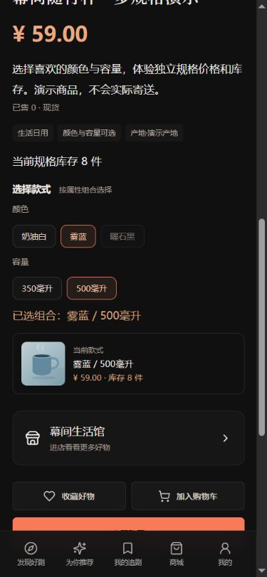
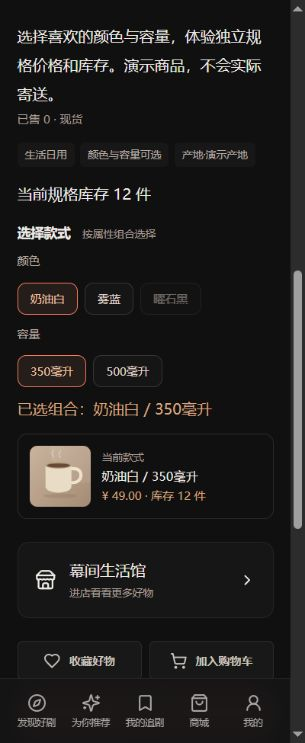
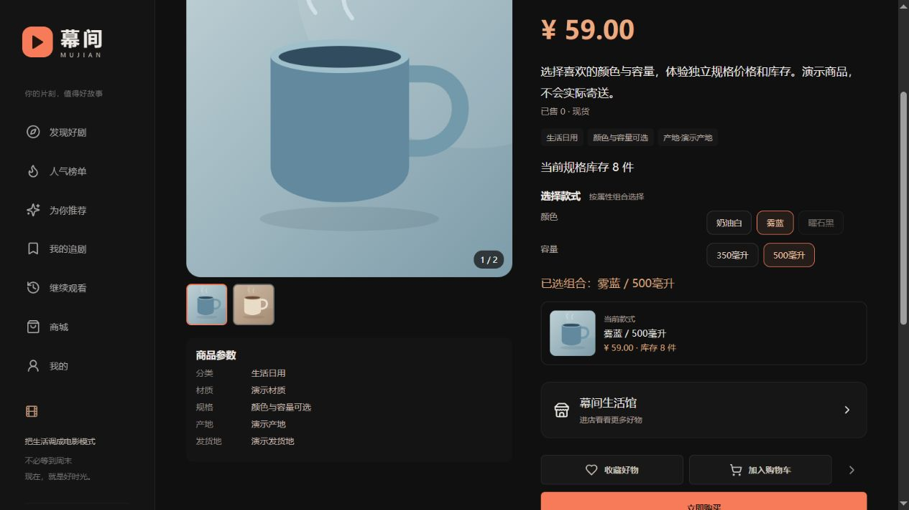

# 规格配图与订单图片快照

本轮把多规格商品从“价格、库存、名称独立”补到“图片也独立”。范围针对商城演示，不接真实商品图片审核或支付履约。

## 用户能看到什么

- 店主在「我的 → 我的店铺 → 属性组合」为每个颜色/容量组合填写图片地址，保存前看到预览；「规格库存」也支持自由规格配图。
- 买家在商品详情选择规格后，主图、当前款式预览和价格/库存同步。没有独立图片的款式自动沿用商品主图。
- 购物车每个规格行展示它自己的图片。立即购买与购物车结算的订单图片取提交时的款式图片。
- 店主之后换图或清空图片，不会改写历史订单；历史订单保存成交时的图片地址和规格名称。

这里的“图片快照”指保存URL，不复制图片文件。如果图片源站覆盖同一URL的文件，历史订单显示的内容也可能改变；后续应接入版本化、不可覆盖的对象存储。

## 地址规则

图片字段支持同源 `/media/` 路径或不带用户信息的 `http/https` URL。服务端拒绝 `javascript:`、`data:`、`file:`、本地路径中的 `..` 或反斜杠、带用户名/密码的 URL 和超过1000字的地址。前端清空输入后保存表示沿用商品主图；旧客户端省略字段或传 `null` 时保留原图片，明确传空字符串或纯空白字符串才清空。格式校验不保证远端图片可访问，也不替代图片内容审核。

## 数据与兼容

新增 `product_variant_image(variant_id,image_url)`，variant_id 唯一并级联删除。购物车查询对规格图片使用 LEFT JOIN；订单继续复用既有 `shop_order.image_url`，下单时写入快照，因此无需修改旧订单表。没有规格的旧商品、旧购物车和旧订单仍按原主图工作。

## 验收结果

Linux 前后端构建通过。`node scripts/verify-variant-images.mjs` 在本机真实 MySQL/HTTP 环境通过 **28 项**：权限、合法/非法 URL、事务回滚、购物车图片、立即购买和购物车订单快照、换图/清图兼容、属性矩阵图片、静态资源和收尾清理。另有规格 API 43 项、属性矩阵 API 18 项回归通过，本地合计89项；本地Java/MySQL运行在Windows，构建在WSL Linux。

部署源码 `3660085` 到 Ubuntu 测试服务器后，云端配图API **28项**和只读部署 **21项**通过。商家页面人工验证编辑保存、重开回显、重复生成组合保留图片；云端320/390px检查两款图片、价格、库存及无横向溢出。一次图片加载失败显示了占位图，刷新后相同URL正常加载，原因未进一步确认。手机网络、压力测试和PWA安装未纳入本轮结果。

仅对独立测试环境运行会写数据的脚本：

```bash
APP_URL=http://106.54.37.247 node scripts/verify-variant-images.mjs --test-environment
APP_URL=http://106.54.37.247 node scripts/verify-deployment.mjs
```

配图脚本使用独立随机密码账号、商品、虚拟地址和演示订单，完成后取消待付款单、清空购物车/地址、下架商品；历史账号、店铺及订单保留。公网部署前已执行数据库和上传文件归档备份，尚无恢复演练；发布包包含新增表初始化及白/蓝/黑演示素材，其中蓝、黑由项目既有SVG派生。支付、物流、图片上传裁剪和图片审核仍属于后续范围。

## 接口变化

| 接口 | 图片行为 |
| --- | --- |
| `GET/PUT /api/shop/products/{id}/variants` | 每个items项支持可选 `imageUrl`；复用店主权限、版本校验及事务 |
| 属性矩阵读取/保存 | 每个组合支持相同字段，与价格、库存一起提交；错误图片使整笔回滚 |
| `GET /api/mall/products/{id}` | variants返回各款图片，客户端留空时沿用商品图 |
| 购物车读取 | 当前规格图片优先，缺失/清空回退商品主图 |
| 立即购买/购物车结算 | 服务端解析规格图片并写入 `shop_order.image_url`，不接受客户端决定订单快照 |

## 直接体验

1. 打开[公网演示商品](http://106.54.37.247/#product/5)。
2. 选择奶油白与350毫升：白色杯子、49元；再选雾蓝与500毫升：蓝色杯子、59元。
3. 在选择按钮下方确认当前款式缩略图；商品主图同步变化。库存为实时数据，截图时分别12件和8件。
4. 店主进入「我的 → 我的店铺 → 属性组合」，为某一款填写图片链接并保存；重新打开仍能看到图片。留空后保存会使用商品主图。

| 390px蓝色款 | 320px白色款 |
| --- | --- |
|  |  |


