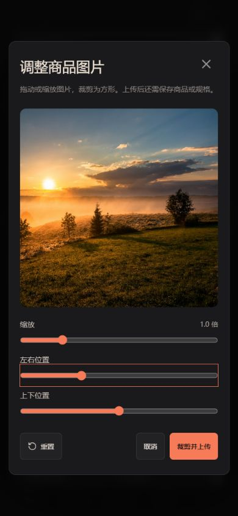
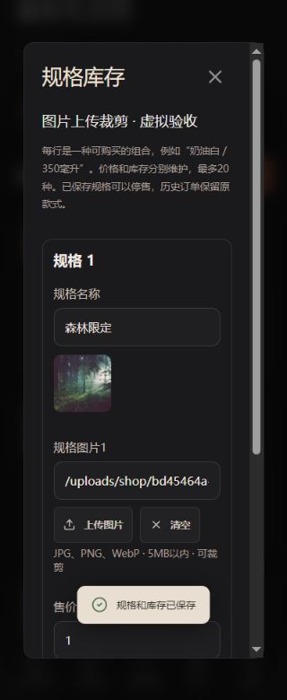

# 商品图片上传与裁剪

商品主图、相册、自由规格和属性组合均支持直接选照片。入口为「我的 → 我的店铺」，原图片链接输入继续保留。上传文件与头像/背景分开存储，替换商品图片不会删除历史订单使用的图片。

## 商家操作与实现情况

| 场景 | 当前效果 |
| --- | --- |
| 商品主图 | 添加/编辑商品 → 上传图片 → 拖动或滑块调整 → 裁剪并上传 → 保存商品 |
| 商品相册 | 添加相册图片，为每张图上传、预览或移除；最多6张，保存商品后生效 |
| 每款规格图 | 规格库存/属性组合中，每行都有上传、预览与清空；留空沿用商品主图 |
| 取消与失败 | 取消裁剪不上传、不改草稿；上传失败留在裁剪窗口并显示中文错误，可重试 |
| 区分上传和保存 | 上传只回填当前草稿，并提示“保存表单后生效”；不会自动上架或覆盖商品资料 |
| 手机编辑 | 320/390px裁剪窗口适配；属性组合在窄屏改为分行卡片，价格和库存有独立标签 |
| 历史订单 | 图片采用新生成的独立地址；换图、清空规格图、下架商品不会删除旧文件 |

前端选择JPG、PNG、WebP，原文件不超过5,000,000字节、1600万像素；浏览器输出1024×1024白底JPEG。服务端直接上传接口接受真实JPEG/PNG，重新编码为最大边1024像素的JPEG；WebP由浏览器裁剪转换后上传，不代表服务端原生支持WebP。

## 数据与接口

新增 `shop_media`，本阶段共37张表（后续素材库增量后38张）。字段为id、shop_id、url、byte_size、width、height、create_time。文件保存为 `${UPLOAD_DIR}/shop/<UUID>.jpg`，通过 `/uploads/shop/<UUID>.jpg` 公开读取；云端上传根目录仍为 `/var/lib/mujian/uploads`，应用升级不覆盖它。

`POST /api/shop/media/images` 接收multipart字段 `file`。需要登录且拥有有效店铺，成功返回201及 `{url,width,height,bytes}`，不返回磁盘路径或原文件名。服务端读取真实文件格式和尺寸，不信任扩展名/MIME；不接受SVG、HTML、损坏图片、空文件、超限图片。重新编码不保留原EXIF等元数据。

每店最多保留500张，每小时最多成功上传60张；店铺行锁使额度检查和登记串行，失败上传不消耗登记额度。达到小时额度返回429中文提示，达到总量返回409。后续素材库已支持分页、复用和引用数量查看，但收起不释放额度；清理仍需管理员核对所有引用后处理。

`ShopMedia` 负责上传和图片归属校验。主图、相册、自由规格和属性矩阵保存时，上传地址必须是本店 `shop_media` 中存在的规范相对地址；不得绑定他店图片、头像地址、未知文件或路径穿越。旧的 `/media/` 和外部HTTP/HTTPS地址继续按原规则支持。图片本身是公开商品素材，归属校验控制的是写入关联，不代表防止他人下载后再上传。

文件通过随机地址和 `CREATE_NEW` 写入，不复用旧地址；数据库事务回滚时尝试删除本次新文件。订单继续在 `shop_order.image_url` 保存成交时地址，本平台上传图不被商品换图覆盖。外部URL内容仍由其源站控制，无法保证外部图片永久不变。

## 验收

Linux前后端构建通过。本地Java/MySQL服务仍在Windows，WSL负责构建。新增 `verify-shop-media.mjs` **29项通过**，含游客/未开店拒绝、空文件、假JPEG/SVG/截断/超大尺寸/体积、真实格式重编码、公开读取、归属、事务回滚、主图/相册/规格/矩阵、购物车/历史订单、每小时额度及最后名额并发竞争。旧规格配图28项、购物评价68项回归通过，本地合计125项；没有把此前其他轮次结果相加。

部署后在Linux对云端执行同一上传脚本29项通过，另有21项部署只读检查通过。运行源码 `975def4`，入口资源 `index-Dch4hN0P.js` / `index-m5D5V1vq.css`。云端新增表与上传目录工作正常，图片变更后的旧订单原图仍可读取。

公网真实浏览器另以独立虚拟账号开店，在390px页面完成选图、缩放、裁剪上传、保存商品及重开回显；商品已下架并退出测试账号。见[公网裁剪](screenshots/shop-media/remote-mobile-390-crop.png)与[公网保存后重开](screenshots/shop-media/remote-mobile-390-saved.png)。原头像裁剪窗口仍为512×512，打开预览后取消，不修改管理员资料。

浏览器人工检查：取消不回填、裁剪后上传、主图/相册保存及重开、规格上传及重开、320/390px无横向溢出、320px属性组合表内无横向溢出。截图使用本地专用虚拟验收商品和项目已有演示照片，验收商品已下架。断网重试和500张总量边界未做专项运行验证。

复验命令（远端必须明确是测试环境）：

```bash
node scripts/verify-shop-media.mjs
APP_URL=http://106.54.37.247 node scripts/verify-shop-media.mjs --test-environment
APP_URL=http://106.54.37.247 node scripts/verify-deployment.mjs
```

脚本会创建独立随机密码测试账号/店铺和虚拟商品、订单，取消测试订单、清空购物车并下架商品。上传额度用小PNG验证，图片记录及文件、历史订单保留；不要在正式生产库执行这类测试。

| 手机裁剪 | 手机规格上传 |
| --- | --- |
|  |  |

[主图保存后重开](screenshots/shop-media/mobile-390-saved-product.png) · [320px裁剪](screenshots/shop-media/mobile-320-crop.png) · [320px属性组合](screenshots/shop-media/mobile-320-matrix.png)

## 后续边界

素材分页管理、复用、重命名和可恢复收起已在后续增量交付，详见[商家图片素材库](17-商家图片素材库.md)。尚未实现内容审核、版权识别、对象存储/CDN或未引用文件自动清理。用户上传后关闭商品表单，文件仍留存并计入额度；素材清理必须保留商品、购物车和历史订单引用，不能简单按“不是当前主图”删除。生产部署还需全局上传限流、容量告警、审核与垃圾文件治理。

服务端重编码和格式检查属于文件校验，不等于内容审核。当前站点仍为IP HTTP测试环境，支付物流为模拟，可信HTTPS与PWA安装另行验收。
