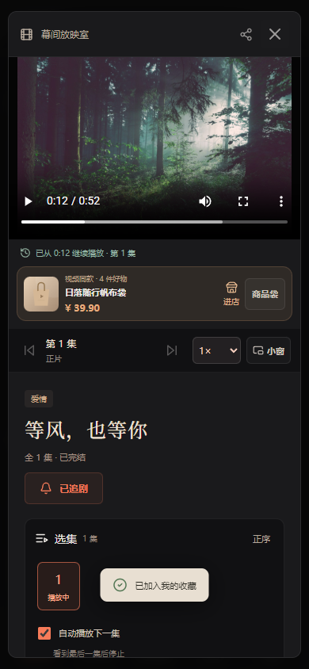

# 首版冻结范围与交付验收

目标版本：幕间 v1.0 演示候选版，2026-10-08。

产品定位是可安装的短剧与商城演示 PWA：新用户可以注册、发现和观看短剧、保存互动与续播进度；商家可以开店、上架商品、发布带货链接视频；买家可以选款、下单并完成明确标注的模拟交易。首版范围以本文件为准，后续功能不再不断加入首版验收条件。

## 交付状态

**本地核心流程、Linux运行、RC2公网部署、云端商城交易、隔离恢复应用、整机重启、可信HTTPS和线上浏览器离线验收已完成；手机真机安装仍待实测，因此保留“真机待验”标记。** Sealos入口为 `https://anthapjdimpo.sealosbja.site`，安装入口和更新流程已交付；公网版本及恢复证据见[Sealos迁移记录](20-Sealos迁移与资源配置.md)。

| 完成条件 | 本轮状态 | 如何判断完成 |
| --- | --- | --- |
| 需求冻结 | 已完成 | 本文列清范围、模拟与待办；03/04为当前需求架构，05/06为后续方案 |
| 短剧核心流程 | 本地通过，Sealos浏览器核心路径16项通过 | 中文注册、登录、搜索、分集播放、追剧收藏、个人进度、重开续播 |
| 商城核心流程 | 本地通过，支付/物流模拟 | 开店、商品/规格库存、视频挂载、购物车、下单、模拟支付、演示发货、收货和评价 |
| 手机页面 | 浏览器手机视口通过 | 320/390px，商品、我的、选图/评价等页面无横向溢出 |
| 可安装App | PWA安装引导已完成，真机待验 | HTTPS下可见安装入口、设备步骤和独立窗口识别；manifest、SW、缓存JS/CSS可用 |
| 离线与续播 | 本地及Sealos桌面浏览器通过，真机待验 | 主动缓存分集，断网刷新、播放和拖动可用，恢复网络后会话保留 |
| 新环境运行 | 独立WSL Linux通过 | 新建独立MySQL库/上传目录，Java服务启动并显示UP/connected |
| 数据恢复 | 本地及云端恢复应用通过 | 云端两次表/文件匹配，恢复库独立应用12项检查通过，临时授权已撤销 |
| 最新云端部署 | Sealos HTTPS已上线，背景遮挡修复、浏览器及商城验收通过 | 新版公网21项、6项版本核对；新站独立浏览器16项、虚拟商城交易28项通过，支付物流仍模拟 |
| 运维准备 | 手动备份恢复及整机重启通过 | 重启后四个单元active/enabled；timer真实触发待验 |

## 冻结功能

| 领域 | 首版包含 |
| --- | --- |
| 账号 | 中文用户名、BCrypt密码、登录token、权限隔离、中文校验及错误信息 |
| 我的 | 可更换头像/背景、昵称、观看记录/收藏、追剧、订单和店铺入口 |
| 短剧 | 分类搜索、榜单、规则推荐、详情、分集、倍速、连播、分享、续播、点赞收藏、评论举报 |
| 追更 | 更新日历、按集预约、后台排期、自动发布、站内提醒、消息信箱 |
| App | 响应式PWA、独立窗口清单、Service Worker应用壳、主动缓存和离线片库 |
| 管理 | 管理员短剧CRUD、分集维护、排期维护、评论举报隐藏/恢复、基础统计 |
| 商家 | 个人开店、店铺资料、商品编辑/上下架、规格属性矩阵、独立库存、视频商品挂载 |
| 图片 | 上传裁剪、主图/相册/规格配图、素材分页复用、中文重命名、引用数、收起恢复 |
| 买家 | 商城搜索筛选分页、详情相册、选款、好物收藏、购物车、地址、整批结算 |
| 演示交易 | 服务端成交价格、库存预留、重复请求幂等、取消/到期返库、模拟支付、演示发货、确认收货、文字评分评价 |

支付与物流始终是模拟，商品及片源为演示内容。PWA是当前选定的App形态；原生APK/IPA、真实支付退款、物流回调、商家资质、商品/图片内容审核、对象存储/CDN及大视频上传转码属于后续需求，不作为本轮已经实现的能力。

## 本轮实际验收

### Linux接口与运行

在WSL Ubuntu **26.04**，Java21、Node22、MySQL8.4的独立验收实例执行；云端仍为Ubuntu24.04。验收实例使用新数据库与上传目录，没有导入Windows或服务器数据。只有演示初始数据和本轮虚拟测试记录。

| 脚本 | 本轮结果 |
| --- | --- |
| `verify.mjs` | 40项：中文注册、账号权限、管理CRUD、互动、评论治理、观看进度和资源 |
| `verify-episodes.mjs` | 28项：分集、独立进度、追剧、权限及级联清理 |
| `verify-releases.mjs` | 46项：预约、排期、提醒、并发和删除清理 |
| `verify-commerce.mjs` | 44项：开店、挂载、购买、模拟交易状态及权限 |
| `verify-shopping.mjs` | 68项：商品详情、收藏、地址、购物车、评价、批量结算回滚 |
| `verify-variants.mjs` | 43项：独立规格库存、快照、取消返库、购物车和并发 |
| `verify-media-library.mjs` | 41项：素材引用、隔离、搜索分页、恢复和并发字段修改 |

Linux接口共310项通过。本轮没有重新执行所有历史脚本；过去轮次的检查不累加到本轮。

离线修复完成后的最新Linux候选应用另执行 `verify-deployment.mjs` 21项只读检查通过；这是最新候选包的资源与健康检查，与恢复库的21项验证分别记录。

### 浏览器及离线

本机Windows Java/MySQL8080服务，独立Edge无头浏览器、手机视口；不使用用户已有浏览器账户。

| 验收 | 本轮结果 |
| --- | --- |
| `verify-first-release-ui.mjs` | 16项通过：页面中文注册、实际解码播放、追剧收藏、进度入库重开、SW及资源缓存、断网刷新播放/拖动、会话保留、320/390px和脚本异常 |
| `verify-reviews-ui.mjs` | 22项通过：模拟支付/发货/收货后的评价入口、评分、失败保留重试、复购、下架评价和手机布局 |
| `verify-sw.mjs` | 通过：缓存壳、旧壳清理、离线媒体保留、完整/Range/非法Range响应；该脚本按一组验证记录 |

首轮离线真实浏览器测试暴露：断网后的网络地址视频在拖动时出现FFmpeg读取失败。新增 `OfflineVideo.tsx` 从Cache Storage读取Blob，播放仅使用对象URL，关闭释放资源；SW应用壳版本升为v4，媒体缓存继续保留。修复后16项全部重跑通过。

[断网播放](screenshots/first-release/mobile-390-offline.png) · [390px商城](screenshots/first-release/mobile-390-mall.png) · [320px商城](screenshots/first-release/mobile-320-mall.png)。截图使用现有演示内容和虚拟账号，不代表手机真机安装验收。

### 备份恢复

本地Linux独立验收库成功执行一致性备份：先暂停该验收实例，导出数据库、记录表级行数/内容校验和、归档上传文件与当前JAR，再启动并检查健康。随后恢复到新建的 `mujian_restore_*` 库和独立目录，所有表与图片逐项匹配；恢复库上的应用启动后21项只读部署检查通过。没有替换原库或删除原上传文件。

`verify-backup-tools.py` 8项通过：有效快照、应用篡改、清单缺项/重复、归档绝对路径/穿越、软链接和硬链接拒绝。备份脚本共享维护锁，避免与升级同时运行；每日备份北京时间04:00，应用短暂停机，定时器的日历表达式和shell语法通过检查。本轮未等待定时器真实触发，也未在云端启用定时器。

以上证明本地数据和文件能够恢复；云端同样的演练、异地备份、备份加密、保留周期、容量告警和性能压测仍待完成。

## 用户演示路线

1. 注册一个中文账号 → 搜索「等风，也等你」→ 播放 → 收藏/追剧 → 关闭后重开验证续播。
2. 我的 → 头像/背景与昵称 → 收藏/历史 → 我的追剧与更新日历。
3. 我的 → 我的店铺 → 创建店铺 → 商品主图/相册上传 → 规格属性 → 素材库复用 → 保存商品。
4. 发布带货视频链接 → 挂本店商品 → 播放页小卡 → 商品选款 → 加购物车 → 填虚拟地址 → 提交演示订单。
5. 买家模拟支付 → 店主演示发货 → 买家确认收货 → 评分评价。另下未付款单取消，验证库存返还。
6. 在线主动缓存视频 → 离线片库 → 断网刷新 → 播放/拖动 → 恢复网络。

演示账号、虚拟数据和失败提示应现场可见；不要用“支付成功”等模糊话术代替明确的模拟说明。

## 后续完成门槛

用户拥有可用域名且能解析到上海服务器后，配置可信HTTPS、证书续期和入口检查。完成候选包云端更新、服务器重启验证、云端备份恢复与真实手机安装验收后，才将本文件中的待办改为通过并发布正式v1.0。

手机安装验收步骤：Android浏览器安装到桌面并独立打开、关闭重开保持功能；iPhone Safari添加到主屏幕并独立打开；分别测试登录、观剧、商城、上传图片，离线缓存与联网恢复。可用性结果须记录手机系统、浏览器版本和截图，不能由桌面手机视口测试替代。

[当前需求](03-当前产品需求.md) · [当前架构](04-当前技术架构.md) · [后续需求](05-增强后总需求.md) · [后续架构](06-增强后总技术架构.md) · [Ubuntu部署](14-Ubuntu测试服务器部署.md)
