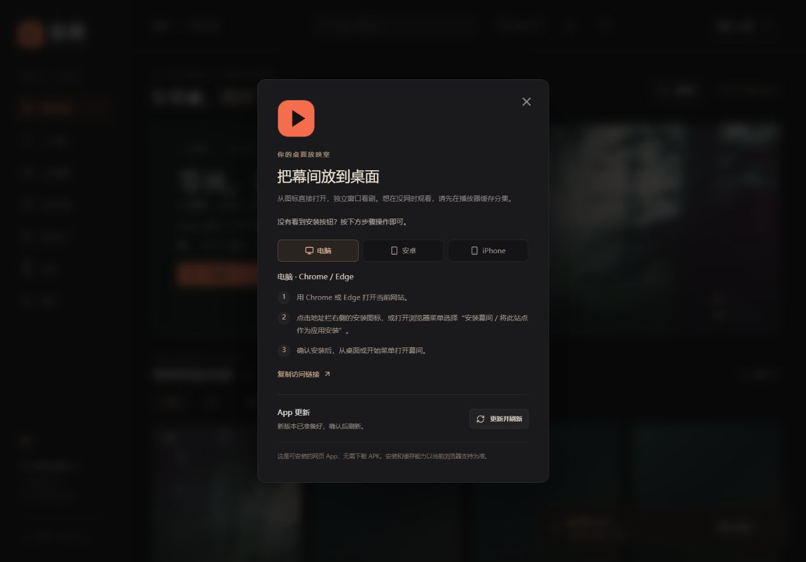
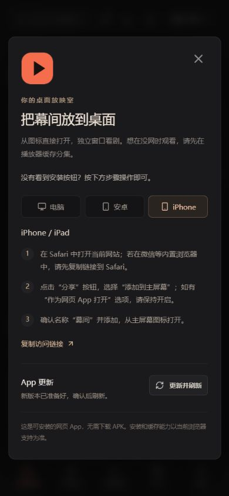
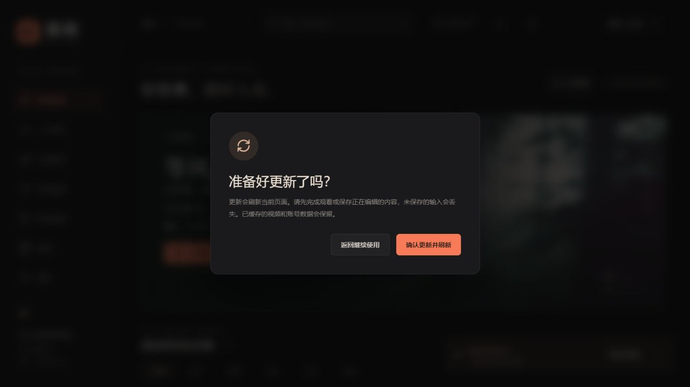

# PWA 安装与更新体验

2026-10-10：在可信 HTTPS 站点加入可见的「安装 App」入口和主动更新流程，补齐“项目做成 App”在网页端的用户路径。已在 Sealos 上线，应用镜像提交 `7d01ad9b2f0283b9f5f46d84f9c2ed910b4a75e5`；[Linux构建与独立MySQL检查](https://github.com/Tony-XUYANG/mujian/actions/runs/38047541916)全部通过。当前 App 形态仍是 PWA，不下载 APK/IPA；公网入口为 [幕间](https://anthapjdimpo.sealosbja.site/#home)。

## 用户能看到什么

顶部工具栏新增手机图标「安装 App」。点击后打开一个中文窗口：

- Chrome / Edge 触发浏览器原生安装提示时，显示「立即安装幕间」按钮；用户取消后不会反复弹窗。
- 未触发原生提示时，按当前设备显示电脑、安卓或 iPhone 的三步安装说明。iPhone 明确要求使用 Safari，微信等内置浏览器需先复制链接。
- HTTP 或其他不安全地址显示“请使用 HTTPS 网站地址”，不把普通网页冒充可安装 App。
- 安装完成由浏览器的 `appinstalled` 或独立窗口状态确认，页面不会在用户点下按钮后直接假报成功。
- 窗口可复制当前访问链接，便于从电脑发到手机。

Service Worker 更新后，工具栏会显示新版本提示。新版本先完成下载并等待，只有用户点击「更新并刷新」才发送 `ACTIVATE_UPDATE`；正在观看、填写表单或使用商城时不会被后台强制刷新。刷新后沿用同一应用缓存，已主动缓存的分集视频位于独立媒体缓存中，不随应用壳清理。

## 技术实现

| 部分 | 实现 |
| --- | --- |
| 安装入口 | `frontend/src/AppTools.tsx`，使用响应式中文窗口、设备步骤、复制链接和状态文案 |
| 生命周期 | `frontend/src/appLifecycle.ts` 统一监听 `beforeinstallprompt`、`appinstalled`、`controllerchange`、`updatefound`，组件卸载会清理监听 |
| 版本缓存 | Vite `writeBundle` 根据构建文件生成20位版本号，写入 `sw.js` 的 `mujian-app-<version>` |
| 延迟激活 | 新 Worker 安装时不调用 `skipWaiting`；仅收到 `ACTIVATE_UPDATE` 消息时激活 |
| 缓存边界 | 导航和壳资源读当前版本；API、跨域、`sw.js`、非 GET 不进入缓存；`mujian-offline-v1` 独立保留视频和封面 |
| 发布兼容 | 每次构建生成 `asset-manifest.json`、`index.html`、`sw.js` 和哈希静态资源；容器发布继续使用完整提交号镜像 |

## 验收结果

- `node scripts/verify-app-lifecycle.mjs`：23 项通过，覆盖中文安装反馈、设备分流、独立窗口识别、HTTP 安全限制、更新确认、断网、超时、卸载清理和多标签行为。
- `node scripts/verify-sw.mjs`：Service Worker 更新激活、版本隔离、媒体缓存保留、API 排除、离线视频 Range 和错误响应通过。
- `npm --prefix frontend run build`：TypeScript 严格编译和 Vite 生产构建通过。
- 本地真实浏览器：先使用A版Worker，再发布测试B版；等待阶段保留A版标题，返回继续使用不刷新，确认后才切换B版；320/390px首页和安装窗口无横向溢出。预览只代理公开读接口，不向线上写入测试用户或订单。
- Linux GitHub Actions：23项安装更新边界检查、Worker检查、生产镜像构建与独立MySQL21项部署检查通过。
- Sealos公网：21项部署只读检查、6项前端文件SHA256核对通过，容器就绪且重启数0；UID10001和上传目录可写保持正常。浏览器已看到顶部安装入口、设备步骤和正常加载的首页/商城，无控制台错误。
- 真机安装仍需在 Android Chrome 与 iPhone Safari 上各实测一次；浏览器视口不能替代真机结果。支付、物流和视频内容仍是演示范围。

## 使用说明

1. 打开 HTTPS 地址，点击顶部手机图标。
2. 电脑或安卓优先点击「立即安装幕间」；iPhone 按 Safari 的分享菜单步骤操作。
3. 播放器内点击「离线缓存」后，离线片库才会出现可断网播放的分集。
4. 看到更新提示时，可先关闭提示继续使用；准备好后再点击「更新并刷新」。
